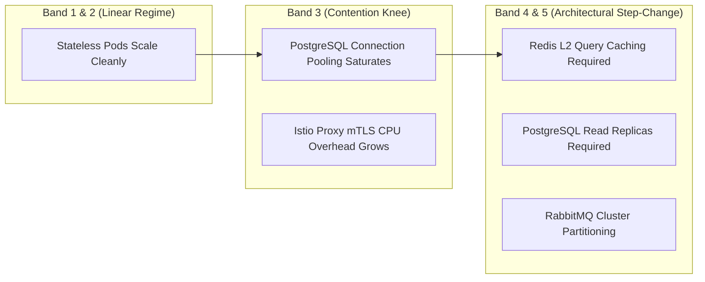

# 🏛️ RealEstate-Trust: Capacity Planning & Performance Bands

This document establishes the official **Performance & Capacity Bands** (T-Shirt Sizing Profiles) for the `RealEstate-Trust` microservices platform. It maps guaranteed infrastructure footprints to predictable throughput, concurrency, and latency SLAs.

---

## 🎯 Strategic Purpose

* **Contractual SLAs**: Clearly guarantees expected performance figures (e.g. $p95 \le 120\text{ ms}$) when infrastructure teams provision designated compute bands.
* **FinOps Efficiency**: Eliminates over-provisioning waste by using OpenCost-measured utilization rather than arbitrary guesswork.
* **Growth Roadmap**: Identifies exactly when architectural step-changes (e.g., adding Redis, read replicas, or distributed partitions) are required as traffic scales.

---

## 📊 The 5 Performance & Capacity Bands

| Band | Tier Name | Target RPS | Concurrent VUs | Node Footprint | Replicas per Service | Pod CPU (Req/Lim) | Pod RAM (Req/Lim) | Target $p95$ SLA | Target Workload |
| :---: | :--- | :---: | :---: | :---: | :---: | :---: | :---: | :---: | :--- |
| **Band 1** | **Starter / Dev** | 10 – 30 | 50 – 150 | 1 Node (2 vCPU, 4GB) | 1 | `50m / 150m` | `64Mi / 128Mi` | $\le 250\text{ ms}$ | Local dev, sandbox, feature branch validation. |
| **Band 2** | **Standard Growth** | 50 – 150 | 250 – 750 | 2 Nodes (4 vCPU, 8GB) | 2 | `100m / 300m` | `128Mi / 256Mi` | $\le 180\text{ ms}$ | Staging environments, early production pilot. |
| **Band 3** | **Regional Volume** | 200 – 500 | 1,000 – 2,500 | 3–4 Nodes (8–12 vCPU, 16–24GB) | 3 – 5 (HPA) | `250m / 600m` | `256Mi / 512Mi` | $\le 120\text{ ms}$ | Production multi-tenant regional operations. |
| **Band 4** | **Enterprise** | 1,000 – 3,000 | 5,000 – 15,000 | 6–10 Nodes (24–40 vCPU, 48–80GB) | 8 – 20 (HPA) | `500m / 1200m` | `512Mi / 1024Mi` | $\le 80\text{ ms}$ | Institutional financial partners, national exchanges. |
| **Band 5** | **Hyper-Scale** | 10,000 – 40,000+ | 50,000+ | 25+ Nodes (100+ vCPU, 256GB+) | 25 – 80+ (KEDA) | `1000m / 2500m` | `1024Mi / 2048Mi` | $\le 50\text{ ms}$ | Global multi-region distributed platform. |

---

## 📈 Scalability Dynamics: Why Scaling is Non-Linear

Scaling does not proceed indefinitely by simply increasing CPU cores. Systems follow the **Universal Scalability Law**:



1. **Band 1 to Band 2 (Resource Adjustment)**:
   * Microservices are predominantly stateless Go binaries. Adding replicas from 1 to 2 yields near-linear throughput increases.
2. **Band 3 (The Contention Knee)**:
   * Concurrent transactions contend for database locks in `transactions` and `ledger_entries`. Requires connection pooling via PgBouncer and HPA tuning.
3. **Band 4 & 5 (Architectural Step-Change)**:
   * Simply adding more pod replicas degrades performance due to database connection exhaustion. Requires read-replicas for catalog browsing, Redis caching for property listings and auth JWKS, and event-driven partitioning.

---

## 🎛️ Calibrating Bands on Local Cluster

We provide dedicated Makefile targets to calibrate each band:

```bash
# Calibrate Band 1 (Starter: 10-30 RPS)
make perf-band-1

# Calibrate Band 2 (Growth: 50-150 RPS)
make perf-band-2

# Calibrate Band 3 (Regional: 200-500 RPS)
make perf-band-3

# Run Capacity & Right-Sizing Analysis
make perf-capacity-report
```

---

## 🔬 FinOps Right-Sizing Formulas

OpenCost and Prometheus telemetry calculate exact container resource boundaries:

$$\text{Recommended CPU Request} = \max\left(50\text{m},\ P_{95}(\text{CPU Usage under Load}) \times 1.20\right)$$
$$\text{Recommended Memory Request} = \max\left(64\text{Mi},\ P_{99}(\text{Working Set RAM}) \times 1.25\right)$$
$$\text{Recommended Memory Limit} = \text{Recommended Memory Request} \times 1.50$$

---

## 📁 Helm Sizing Presets

Pre-configured Helm values files are available under `infra/helm/profiles/`:
* `infra/helm/profiles/values-band1-starter.yaml`
* `infra/helm/profiles/values-band2-growth.yaml`
* `infra/helm/profiles/values-band3-regional.yaml`
* `infra/helm/profiles/values-band4-institutional.yaml`
* `infra/helm/profiles/values-band5-hyperscale.yaml`
