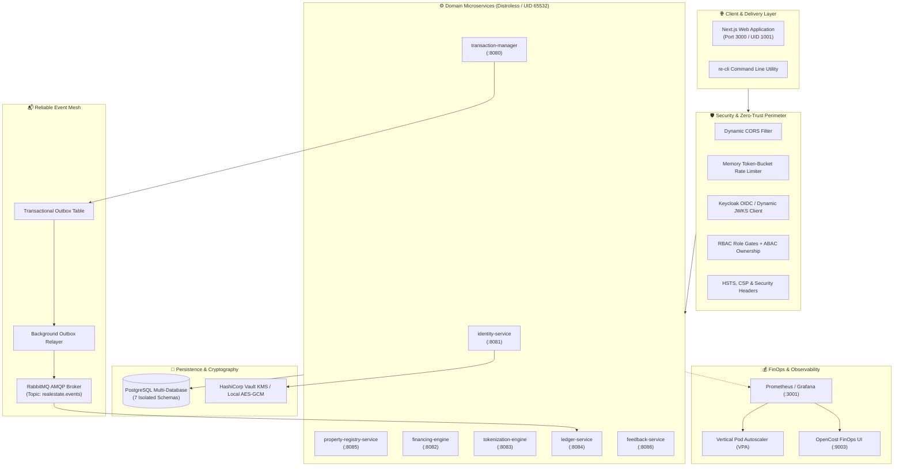
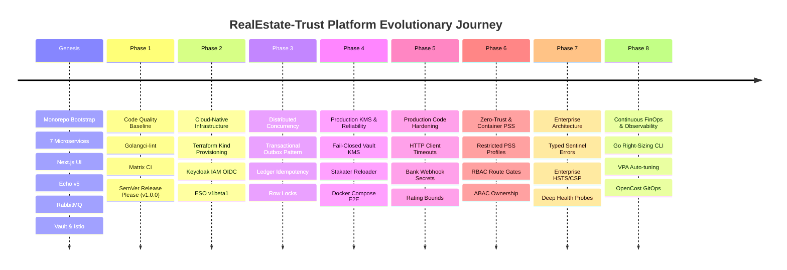

# 🗺️ RealEstate-Trust: Feature Evolution & Architectural Journey

An authoritative reference detailing the complete evolutionary history, architectural milestones, supported features, and security posture of the **RealEstate-Trust Monorepo Platform** from initial repository genesis across its Pull Requests and major milestone releases.

---

## 📑 Table of Contents
1. [Executive Summary & System Vision](#-executive-summary--system-vision)
2. [Foundational Genesis Commits (Pre-PR Architecture)](#-foundational-genesis-commits-pre-pr-architecture)
3. [Evolutionary Timeline](#-evolutionary-timeline)
4. [Chronological Engineering Phases](#-chronological-engineering-phases)
5. [Supported Feature & Capability Matrix](#-supported-feature--capability-matrix)
6. [Pull Request (PR) Index (PRs #1 – #46)](#-pull-request-pr-index-prs-1--46)
7. [Core Architectural Patterns Implemented](#-core-architectural-patterns-implemented)
8. [Verification, CI/CD & Testing Infrastructure](#-verification-cicd--testing-infrastructure)

---

## 🎯 Executive Summary & System Vision

**RealEstate-Trust** is an institutional-grade, zero-trust digital real estate tokenization and escrow transaction platform. Built as a Go-based microservice monorepo with a Next.js web application frontend, it provides cryptographically verified property escrows, tokenized fractional investments, automated bank financing workflows, an immutable audit ledger, and continuous FinOps right-sizing.



---

## 🏛️ Foundational Genesis Commits (Pre-PR Architecture)

Prior to formal pull request workflow gating, the platform underwent rapid architectural foundation construction across several critical commit milestones:

### 1. Monorepo Scaffolding & Initial Microservices (`4de286c` – `898b9db`)
- Initialized Go monorepo structure with 5 foundational microservices: `transaction-manager`, `identity-service`, `financing-engine`, `tokenization-engine`, and `ledger-service`.
- Integrated root `Makefile`, pre-commit hooks (`golangci-lint`, `hadolint`, `tflint`), and initial CI test workflows.
- Implemented critical domain rules (e.g., 80% LTV mortgage limits, deal status state machine).

### 2. Next.js Frontend Bootstrap & Luxury UI (`04549b0` – `1b57eb6`)
- Bootstrapped Next.js 14 React frontend with Tailwind CSS v4 and Zustand state stores.
- Designed luxury aesthetic with gold accents, refined typography, and glassmorphism styling.
- Localized all currency displays to Indian Rupees (INR ₹).
- Added interactive guided user journeys widget and buyer/seller/broker dashboard modals.

### 3. Service Expansion & Schema Persistence (`1d2d4fe` – `6bece76`)
- **`property-registry-service`** (`:8085`): Added property marketplace UI, land title registry, and escrow funding workflows.
- **`feedback-service`** (`:8086`): Added post-transaction review collection and 1–5 rating validation.
- Implemented PostgreSQL persistence repositories across all 7 services with isolated databases (`identity_db`, `transactions_db`, `properties_db`, `financing_db`, `tokenization_db`, `ledger_db`, `feedback_db`) and migration hooks (`000001_*.up.sql`).

### 4. Framework Modernization & Authentication (`4e14069` – `51a1cc4`)
- Migrated all microservices and HTTP handlers to the **Echo v5** web framework.
- Upgraded password security with Bcrypt hashing (Cost 12), user session management, refresh token rotation, and idle logout timers.
- Added initial AES-256-GCM encryption utilities for KYC/PII data.

### 5. Asynchronous Messaging & Tracing Mesh (`9bae287` – `3c5f197`)
- Integrated RabbitMQ AMQP messaging with publisher confirms, manual acknowledgments, and Dead Letter Queues (DLQs).
- Implemented distributed correlation ID middleware (`X-Correlation-ID`) propagating across HTTP headers, log context, and AMQP message attributes.

### 6. Service Mesh, Vault KMS & GitOps Packaging (`00e49a2` – `64e284a`)
- Integrated **Istio Service Mesh** and Ingress Gateway routing with ClusterIP service backends.
- Integrated **HashiCorp Vault** and **External Secrets Operator (ESO)** for dynamic database credential rotation and secret synchronization.
- Packaged services into reusable Helm charts (`infra/helm/charts/microservice`) with KEDA autoscaling triggers and ArgoCD App-of-Apps GitOps definitions.

---

## ⏳ Evolutionary Timeline



---

## 🚀 Chronological Engineering Phases

### **Phase 1: Code Quality Baseline & Initial Release**
- **Focus**: Formatting, error checking, and automated release pipelines.
- **Milestones**:
  - Formatted codebase and resolved all lint errors ([PR #1](https://github.com/NItishSh/realestate-trust/pull/1)).
  - Automated SemVer release pipeline with Release Please ([PR #2](https://github.com/NItishSh/realestate-trust/pull/2) - `v1.0.0`).

---

### **Phase 2: Cloud-Native Infrastructure & GitOps Integration**
- **Focus**: Production-ready containerization, Kubernetes packaging, and GitOps pipelines.
- **Milestones**:
  - Upgraded External Secrets Operator to `v1beta1` ([PR #3](https://github.com/NItishSh/realestate-trust/pull/3)).
  - Standardized microservice Helm charts (`infra/helm/charts/microservice`) with dynamic smoke test jobs ([PR #5](https://github.com/NItishSh/realestate-trust/pull/5), [PR #6](https://github.com/NItishSh/realestate-trust/pull/6)).
  - Automated local Kubernetes cluster provisioning with Terraform (`infra/terraform`) and ArgoCD App-of-Apps GitOps integration ([PR #7](https://github.com/NItishSh/realestate-trust/pull/7)).
  - Configured Keycloak IAM integration for OpenID Connect (OIDC) realm provisioning.
  - Target revision GitOps alignment to `main` ([PR #9](https://github.com/NItishSh/realestate-trust/pull/9)).
  - Added ESO webhook warm-up retry logic and created the Cloud KMS Production Porting Guide ([PR #11](https://github.com/NItishSh/realestate-trust/pull/11)).
  - **Releases**: `v1.0.1` ([PR #4](https://github.com/NItishSh/realestate-trust/pull/4)), `v1.1.0` ([PR #8](https://github.com/NItishSh/realestate-trust/pull/8)), `v1.1.1` ([PR #10](https://github.com/NItishSh/realestate-trust/pull/10)), `v1.1.2` ([PR #12](https://github.com/NItishSh/realestate-trust/pull/12)).

---

### **Phase 3: Data Consistency & Distributed Concurrency Remediation**
- **Focus**: Eliminating distributed data races, race conditions, and event loss.
- **Milestones**:
  - **Distributed Ledger Idempotency**: Added database-level unique constraint on `(transaction_id, entry_type)` with atomic `ON CONFLICT DO NOTHING` handling to prevent duplicate ledger transactions under concurrent webhook replays ([PR #13](https://github.com/NItishSh/realestate-trust/pull/13)).
  - **Transactional Outbox Pattern**: Unified transaction state changes and outbox event logging into a single atomic PostgreSQL transaction (`BEGIN ... INSERT outbox_events ... COMMIT`), ending dual-write hazards ([PR #13](https://github.com/NItishSh/realestate-trust/pull/13)).
  - **Tokenization Concurrency Guards**: Applied `SELECT ... FOR UPDATE` row-level locking on fractional pools to prevent overselling shares during parallel buyer requests ([PR #13](https://github.com/NItishSh/realestate-trust/pull/13)).
  - **Standardized CloudEvents v1.0**: Standardized JSON payload serialization across the asynchronous message mesh ([PR #13](https://github.com/NItishSh/realestate-trust/pull/13)).
  - **Release**: `v1.2.0` ([PR #14](https://github.com/NItishSh/realestate-trust/pull/14)).

---

### **Phase 4: Cryptographic Security, KMS & Config Reloading**
- **Focus**: Zero-trust key management and automated configuration management.
- **Milestones**:
  - **Fail-Closed Production KMS**: Hardened KYC data encryption so that in `APP_ENV=production`, missing or unreachable HashiCorp Vault Transit KMS immediately fails closed without silent fallback to local dev keys ([PR #16](https://github.com/NItishSh/realestate-trust/pull/16)).
  - **Zero-Downtime Secret Rotation**: Integrated Stakater Reloader annotations (`reloader.stakater.com/auto: "true"`) into Helm deployment templates for rolling pod reloads on Secret/ConfigMap updates ([PR #16](https://github.com/NItishSh/realestate-trust/pull/16)).
  - **Automated E2E Suite Target**: Built `make compose-test-e2e` for spinning up the full 7-migration, 7-service stack and validating deal lifecycle transitions in CI ([PR #15](https://github.com/NItishSh/realestate-trust/pull/15), [PR #18](https://github.com/NItishSh/realestate-trust/pull/18)).
  - **Release**: `v1.3.0` ([PR #17](https://github.com/NItishSh/realestate-trust/pull/17)).

---

### **Phase 5: Production Code Auditing & Resilience**
- **Focus**: Eliminating socket leaks, unauthenticated endpoints, and unbounded input fields.
- **Milestones**:
  - **HTTP Client Timeouts & Resource Management**: Replaced default unbound HTTP clients with a 5-second timeout client and guaranteed `defer resp.Body.Close()` in `property_handlers.go` ([PR #19](https://github.com/NItishSh/realestate-trust/pull/19)).
  - **Bank Webhook Security**: Added `X-Webhook-Secret` verification to `POST /api/v1/loans/webhooks/bank` against `BANK_WEBHOOK_SECRET` ([PR #19](https://github.com/NItishSh/realestate-trust/pull/19)).
  - **Input Boundary Enforcement**: Enforced strict 1–5 range bounds on rating submissions in `feedback_handlers.go` ([PR #19](https://github.com/NItishSh/realestate-trust/pull/19)).
  - **Release**: `v1.4.0` ([PR #20](https://github.com/NItishSh/realestate-trust/pull/20)).

---

### **Phase 6: Zero-Trust Perimeter, RBAC/ABAC & Container Security**
- **Focus**: Hardening container profiles against kernel exploitation and implementing granular authorization gates.
- **Milestones**:
  - **Auth Rate Limiting**: Added token-bucket memory rate limiter (`10 req/s, Burst: 20`) on registration and login endpoints ([PR #21](https://github.com/NItishSh/realestate-trust/pull/21)).
  - **Dynamic CORS**: Replaced wildcard origins with comma-separated `CORS_ALLOWED_ORIGINS` across all 7 services ([PR #21](https://github.com/NItishSh/realestate-trust/pull/21)).
  - **Kubernetes Restricted Pod Security Standards**: Enforced `seccompProfile: { type: RuntimeDefault }`, `runAsUser: 65532` (Distroless `nonroot`), `readOnlyRootFilesystem: true`, and `capabilities: { drop: ["ALL"] }` across Helm charts ([PR #22](https://github.com/NItishSh/realestate-trust/pull/22)).
  - **Comprehensive RBAC & ABAC Gates**: Enforced role-based route middleware (`db.RBACMiddleware`) and attribute ownership validation (`sub == id || role == ADMIN`) across all endpoints ([PR #23](https://github.com/NItishSh/realestate-trust/pull/23)).
  - **XSS Sanitization**: Added `core.SanitizeString` to sanitize text inputs against HTML injection ([PR #23](https://github.com/NItishSh/realestate-trust/pull/23)).

---

### **Phase 7: Enterprise Architecture, Typed Errors & Deep Probes**
- **Focus**: Clean domain error propagation, enterprise headers, and Kubernetes probe accuracy.
- **Milestones**:
  - **Typed Sentinel Errors**: Replaced fragile string matching with `errors.Is(err, core.ErrNotFound)` and domain sentinel error definitions ([PR #25](https://github.com/NItishSh/realestate-trust/pull/25)).
  - **Enterprise Security Headers**: Enforced HSTS (`max-age=31536000`), CSP (`default-src 'self'`), `X-Frame-Options: DENY`, and `X-Content-Type-Options: nosniff` ([PR #25](https://github.com/NItishSh/realestate-trust/pull/25)).
  - **Centralized Service Configuration**: Created unified `internal/core/config.go` with fail-fast validation and diagnostic boot logging ([PR #27](https://github.com/NItishSh/realestate-trust/pull/27)).
  - **Deep Kubernetes Health Probes**: Decoupled `/api/v1/health/live` (process liveness) from `/api/v1/health/ready` (active PostgreSQL pool ping and RabbitMQ connection checks) ([PR #27](https://github.com/NItishSh/realestate-trust/pull/27)).
  - **Smoke Test RBAC Alignment**: Fixed tokenization-engine smoke test user role to `SELLER` to satisfy route authorization ([PR #28](https://github.com/NItishSh/realestate-trust/pull/28)).
  - **Releases**: `v1.5.0` ([PR #26](https://github.com/NItishSh/realestate-trust/pull/26)), `v1.6.0` ([PR #29](https://github.com/NItishSh/realestate-trust/pull/29)).

---

### **Phase 8: Continuous FinOps Workload Right-Sizing & Observability**
- **Focus**: Eliminating idle cloud compute waste and automated feedback loops.
- **Milestones**:
  - **Pure Go FinOps CLI**: Implemented `re-cli finops rightsize [--dry-run]` natively in Go with +20% safety headroom and 1.5x memory limit multiplier ([PR #30](https://github.com/NItishSh/realestate-trust/pull/30)).
  - **OpenCost GitOps Ingestion**: Deployed OpenCost in ArgoCD Sync Wave 3 connected to Prometheus for real-time cost breakdown ([PR #30](https://github.com/NItishSh/realestate-trust/pull/30)).
  - **VPA Helm Templates**: Added `VerticalPodAutoscaler` recommendation templates (`updateMode: "Off"`) to microservice Helm charts ([PR #30](https://github.com/NItishSh/realestate-trust/pull/30)).
  - **Surgical AST YAML Manipulation**: Upgraded right-sizing engine to use `yaml.Node` AST manipulation, preserving exact key ordering, comments, and whitespace formatting ([PR #31](https://github.com/NItishSh/realestate-trust/pull/31)).
  - **Weekly Automated Feedback Loop**: Added `.github/workflows/finops-rightsize.yaml` running weekly to open automated right-sizing PRs.
  - **Comprehensive Documentation Sync**: Synchronized README, System Manual, and Microservices Catalog with the 7-service architecture ([PR #32](https://github.com/NItishSh/realestate-trust/pull/32), [PR #33](https://github.com/NItishSh/realestate-trust/pull/33)).

---

## 📊 Supported Feature & Capability Matrix

| Feature | Owning Service | Port | Primary Endpoints | Storage Table | Security & Access Policy |
| :--- | :--- | :---: | :--- | :--- | :--- |
| **User Registration & Login** | `identity-service` | `8081` | `POST /api/v1/users`<br>`POST /api/v1/login` | `users`, `user_sessions` | Rate-limited (10 rps), BCrypt (Cost 12), Email regex |
| **KYC Identity Verification** | `identity-service` | `8081` | `POST /api/v1/users/:id/kyc`<br>`GET /api/v1/users/:id/kyc/status` | `kyc_verifications` | ABAC Owner/Admin check, HashiCorp Vault KMS encryption |
| **Escrow Transaction Management** | `transaction-manager` | `8080` | `POST /api/v1/transactions`<br>`PUT /api/v1/transactions/:id/status`<br>`POST /api/v1/transactions/:id/escrow/fund` | `transactions`, `escrow_accounts`, `outbox_events` | RBAC (Buyer/Seller/Broker/Officer/Admin), Outbox Relay Atomicity |
| **Property Title & Documents** | `property-registry-service` | `8085` | `POST /api/v1/properties`<br>`GET /api/v1/properties`<br>`POST /api/v1/properties/:id/insurance/verify`<br>`POST /api/v1/properties/:id/documents/unlock` | `properties`, `property_documents` | RBAC (Seller/Broker/Officer/Admin), HTTP client timeout |
| **Mortgage & Loan Underwriting** | `financing-engine` | `8082` | `POST /api/v1/loans`<br>`GET /api/v1/loans`<br>`POST /api/v1/loans/:id/disburse`<br>`POST /api/v1/loans/webhooks/bank` | `loan_applications` | LTV ratio validation (≤80%), `X-Webhook-Secret` verification, Officer disbursal gate |
| **Fractional Asset Tokenization** | `tokenization-engine` | `8083` | `POST /api/v1/pools`<br>`GET /api/v1/pools`<br>`POST /api/v1/pools/:id/buy` | `fractional_pools`, `fractional_holdings` | `SELECT FOR UPDATE` row locks, RBAC Seller/Buyer |
| **Cryptographic Immutable Ledger** | `ledger-service` | `8084` | `POST /api/v1/entries`<br>`GET /api/v1/entries` | `ledger_entries` | SHA-256 Merkle chain, Unique compound idempotency key |
| **Broker Reputation & Feedback** | `feedback-service` | `8086` | `POST /api/v1/reviews`<br>`GET /api/v1/brokers/:id/rating` | `broker_feedback` | 1–5 rating validation, CORS origin restriction |
| **FinOps Right-Sizing** | `re-cli` | N/A | `re-cli finops rightsize` | `infra/kind/values/*.yaml` | VPA p95 telemetry, +20% safety headroom, 1.5x limit multiplier |

---

## 📦 Pull Request (PR) Index (PRs #1 – #46)

| PR # | Type | Title | Key Files Changed | Impact |
| :---: | :---: | :--- | :--- | :--- |
| **[#1](https://github.com/NItishSh/realestate-trust/pull/1)** | `fix` | resolve remaining errcheck and govet issues | `cmd/*/main.go`, `internal/db/*.go` | Zero golangci-lint errors baseline |
| **[#2](https://github.com/NItishSh/realestate-trust/pull/2)** | `release` | Release 1.0.0 | Monorepo root | Initial stable version tag |
| **[#3](https://github.com/NItishSh/realestate-trust/pull/3)** | `fix` | update external-secrets apiVersion to v1beta1 | `infra/gitops/secret-store.yaml` | Kubernetes 1.28+ compatibility |
| **[#4](https://github.com/NItishSh/realestate-trust/pull/4)** | `release` | Release 1.0.1 | Monorepo root | Patch version release |
| **[#5](https://github.com/NItishSh/realestate-trust/pull/5)** | `fix` | Fix smoke test script ports to use default port 80 | `infra/helm/charts/microservice/` | ClusterIP Service routing fix |
| **[#6](https://github.com/NItishSh/realestate-trust/pull/6)** | `fix` | Fix local helm values smoke test ports | `infra/gitops/service-apps.yaml` | In-cluster smoke test stability |
| **[#7](https://github.com/NItishSh/realestate-trust/pull/7)** | `feat` | Terraform Kind provisioning, Keycloak IAM GitOps integration | `infra/terraform/`, `infra/gitops/` | Automated 1-click local Kind infrastructure |
| **[#8](https://github.com/NItishSh/realestate-trust/pull/8)** | `release` | Release 1.1.0 | Monorepo root | Minor version release |
| **[#9](https://github.com/NItishSh/realestate-trust/pull/9)** | `fix` | update targetRevision from feature branch to main | `infra/gitops/service-apps.yaml` | GitOps branch consistency |
| **[#10](https://github.com/NItishSh/realestate-trust/pull/10)** | `release` | Release 1.1.1 | Monorepo root | Patch version release |
| **[#11](https://github.com/NItishSh/realestate-trust/pull/11)** | `fix` | add retry loop for ESO webhook warm-up and add production porting guide | `infra/terraform/`, `docs/` | Flakeless ESO provisioning + AWS/GCP guide |
| **[#12](https://github.com/NItishSh/realestate-trust/pull/12)** | `release` | Release 1.1.2 | Monorepo root | Patch version release |
| **[#13](https://github.com/NItishSh/realestate-trust/pull/13)** | `feat` | remediate critical data consistency and distributed concurrency gaps (Phase 1 & 2) | `internal/db/`, `internal/events/` | Outbox atomicity, Ledger write idempotency, Pool row locks |
| **[#14](https://github.com/NItishSh/realestate-trust/pull/14)** | `release` | Release 1.2.0 | Monorepo root | Minor version release |
| **[#15](https://github.com/NItishSh/realestate-trust/pull/15)** | `docs` | update architectural gaps status and add compose-test-e2e make target | `docs/`, `Makefile` | Automated compose E2E target |
| **[#16](https://github.com/NItishSh/realestate-trust/pull/16)** | `feat` | complete Phase 3 gaps (GAP-08 fail-closed KMS, GAP-10 reloader rotation) | `internal/db/crypto.go`, `infra/helm/` | Zero-downtime config reloads + Fail-closed Vault KMS |
| **[#17](https://github.com/NItishSh/realestate-trust/pull/17)** | `release` | Release 1.3.0 | Monorepo root | Minor version release |
| **[#18](https://github.com/NItishSh/realestate-trust/pull/18)** | `fix` | make compose E2E test in CI deterministic and fix postgres healthcheck | `Makefile`, `docker-compose.yaml` | Flakeless Docker Compose E2E in GitHub Actions |
| **[#19](https://github.com/NItishSh/realestate-trust/pull/19)** | `feat` | harden HTTP client timeouts, webhook authentication, and input boundaries | `internal/db/*.go` | Sockets closed, bank webhook secret auth, rating boundaries |
| **[#20](https://github.com/NItishSh/realestate-trust/pull/20)** | `release` | Release 1.4.0 | Monorepo root | Minor version release |
| **[#21](https://github.com/NItishSh/realestate-trust/pull/21)** | `feat` | add auth rate limiting and dynamic CORS configuration | `internal/db/middleware.go`, `cmd/*/` | Sensitive endpoint rate limits (10 rps) & dynamic CORS |
| **[#22](https://github.com/NItishSh/realestate-trust/pull/22)** | `feat` | enforce Kubernetes Restricted Pod Security Standards across Helm microservice charts | `infra/helm/charts/microservice/` | `seccompProfile: RuntimeDefault`, `runAsUser: 65532`, `drop: [ALL]` |
| **[#23](https://github.com/NItishSh/realestate-trust/pull/23)** | `feat` | enforce RBAC/ABAC role gates, attribute ownership, and input sanitization | `cmd/*/main.go`, `internal/db/`, `internal/core/` | Zero-trust RBAC route middleware, ABAC ownership, XSS escaping |
| **[#24](https://github.com/NItishSh/realestate-trust/pull/24)** | `docs` | create comprehensive feature evolution and architectural journey guide | `docs/FEATURE_JOURNEY.md` | Authoritative engineering history and capability catalog |
| **[#25](https://github.com/NItishSh/realestate-trust/pull/25)** | `feat` | implement typed sentinel domain errors, enterprise HSTS/CSP security headers | `internal/core/errors.go`, `internal/db/`, `cmd/*/` | Idiomatic `errors.Is` error checking, HSTS/CSP middleware |
| **[#26](https://github.com/NItishSh/realestate-trust/pull/26)** | `release` | Release 1.5.0 | Monorepo root | Minor version release |
| **[#27](https://github.com/NItishSh/realestate-trust/pull/27)** | `feat` | implement centralized service config and deep Kubernetes readiness probes | `internal/core/config.go`, `internal/db/health.go`, `infra/helm/` | Dynamic Liveness/Readiness probes (`/health/live`, `/health/ready`) |
| **[#28](https://github.com/NItishSh/realestate-trust/pull/28)** | `fix` | update tokenization-engine smoke test user role to SELLER for RBAC compliance | `infra/gitops/service-apps.yaml` | Resolves smoke test 403 authorization error |
| **[#29](https://github.com/NItishSh/realestate-trust/pull/29)** | `release` | Release 1.6.0 | Monorepo root | Minor version release |
| **[#30](https://github.com/NItishSh/realestate-trust/pull/30)** | `feat` | implement FinOps right-sizing pipeline, OpenCost GitOps, and VPA templates | `cmd/re-cli/finops.go`, `infra/`, `.github/` | Automated VPA tuning (+20% safety buffer) & OpenCost UI |
| **[#31](https://github.com/NItishSh/realestate-trust/pull/31)** | `fix` | use AST yaml.Node manipulation to preserve exact key ordering and whitespace | `cmd/re-cli/finops.go`, `infra/kind/values/` | Surgical YAML diffs preserving comments and structure |
| **[#32](https://github.com/NItishSh/realestate-trust/pull/32)** | `docs` | index PR #30 and PR #31 in feature journey guide | `docs/FEATURE_JOURNEY.md` | PR catalog update |
| **[#33](https://github.com/NItishSh/realestate-trust/pull/33)** | `docs` | sync README, microservices catalog, and feature journey with 7-service architecture | `README.md`, `docs/` | Unified 7-service and FinOps documentation |
| **[#34](https://github.com/NItishSh/realestate-trust/pull/34)** | `docs` | document foundational pre-PR genesis commits in feature journey | `docs/FEATURE_JOURNEY.md` | Catalog of initial 6 genesis milestones |
| **[#35](https://github.com/NItishSh/realestate-trust/pull/35)** | `docs` | add NodeLocal DNSCache requirement to production porting checklist | `docs/production_porting_guide.md` | In-node DNS caching roadmap for EKS/GKE/AKS |
| **[#36](https://github.com/NItishSh/realestate-trust/pull/36)** | `feat` | add cluster-endpoints dashboard and monitoring links to Makefile and reset.sh | `Makefile`, `reset.sh` | Terminal endpoint dashboard + port-forwarding |
| **[#38](https://github.com/NItishSh/realestate-trust/pull/38)** | `fix` | default vpa.enabled to false so microservices sync without VPA CRD requirement | `infra/helm/charts/microservice/` | Resolves ArgoCD sync dependency on VPA CRD |
| **[#39](https://github.com/NItishSh/realestate-trust/pull/39)** | `fix` | update Istio gateway routes to use ClusterIP service port 80 | `infra/kind/manifests/istio-gateway.yaml` | Fixes 503 Service Unavailable on Unified Gateway |
| **[#40](https://github.com/NItishSh/realestate-trust/pull/40)** | `fix` | clarify Unified Istio Gateway paths and port-forward commands in make endpoints | `Makefile` | Explicit endpoint paths & port-forward guides |
| **[#41](https://github.com/NItishSh/realestate-trust/pull/41)** | `docs` | index PRs #34 through #40 in feature journey | `docs/FEATURE_JOURNEY.md` | PR catalog update |
| **[#42](https://github.com/NItishSh/realestate-trust/pull/42)** | `feat` | add make grafana-password helper and update endpoints dashboard | `Makefile` | Dynamic extraction of Grafana secret password |
| **[#43](https://github.com/NItishSh/realestate-trust/pull/43)** | `docs` | index PR #41 and #42 in feature journey | `docs/FEATURE_JOURNEY.md` | PR catalog update |
| **[#44](https://github.com/NItishSh/realestate-trust/pull/44)** | `fix` | align port-forward targets with k8s service ports and unify istio observability routes | `Makefile`, `infra/kind/manifests/` | Fixes port forwarding targets & unifies Istio routes |
| **[#45](https://github.com/NItishSh/realestate-trust/pull/45)** | `docs` | index PR #43 and #44 in feature journey | `docs/FEATURE_JOURNEY.md` | PR catalog update |
| **[#46](https://github.com/NItishSh/realestate-trust/pull/46)** | `fix` | set explicit proxy image for istio-ingress gateway | `infra/gitops/core-infra-apps.yaml` | Fixes gateway ErrImagePull defaulting to auto |

---

## 🏛️ Core Architectural Patterns Implemented

### 1. **Transactional Outbox Pattern**
To prevent dual-write inconsistencies between PostgreSQL and RabbitMQ, all transaction status modifications write an `outbox_events` row inside the **same atomic database transaction**. A dedicated background daemon (`OutboxProcessor`) polls pending events, transmits them over AMQP, and marks them `PROCESSED`.

### 2. **Distributed Ledger Idempotency & Hash Chaining**
Every state change creates an immutable `ledger_entries` record. Write idempotency is guaranteed by a compound unique constraint on `(transaction_id, entry_type)` with `ON CONFLICT DO NOTHING`. Each entry stores `previous_hash` and `current_hash` computed over `(prev_hash + tx_id + amount + timestamp)` creating a tamper-evident cryptographic chain.

### 3. **Dual-Mode Cryptographic KMS**
Sensitive KYC records (passports, national IDs) are encrypted via HashiCorp Vault Transit KMS. In local development (`APP_ENV != production`), an automatic fallback to local AES-256-GCM is permitted. In production (`APP_ENV=production`), the system **fails closed** if Vault Transit KMS is unreachable.

### 4. **Keycloak JWKS Verification with Dual-Mode Signature Support**
Supports both RS256/ES256 asymmetric cryptographic verification via Keycloak's dynamic JSON Web Key Set (`/realms/realestate-trust/protocol/openid-connect/certs`) and HS256 HMAC shared secrets for isolated microservice tests.

### 5. **Kubernetes Restricted Pod Security Standard (PSS)**
Workload pods run under Google Distroless with zero Linux capabilities (`drop: ["ALL"]`), read-only root filesystems (`readOnlyRootFilesystem: true`), non-root UID `65532`, and kernel syscall filtering (`seccompProfile: { type: RuntimeDefault }`).

### 6. **Automated FinOps Workload Right-Sizing & OpenCost Observability**
Continuously ingests empirical p95/p99 consumption metrics from in-cluster Vertical Pod Autoscalers (VPA in recommendation mode) and OpenCost. Applies a **+20% safety headroom**, sets memory limits at 1.5x to prevent `OOMKilled` crashes, and enforces minimum floor bounds (`25m CPU / 32Mi RAM`). Automated weekly through GitHub Actions with surgical AST-based YAML preservation.

---

## 🧪 Verification, CI/CD & Testing Infrastructure

The repository enforces strict multi-layered automated verification across all layers of the monorepo:

```bash
# 1. Monorepo Linter Suite (golangci-lint, hadolint, terraform validate, tflint, helm lint)
make lint

# 2. Complete Unit & Contract Test Suite
go test -v ./...

# 3. Full Local Docker Compose Stack & End-to-End Deal Lifecycle Test
make compose-test-e2e

# 4. Terraform Kind Cluster Provisioning & GitOps Bootstrap
make cluster-up

# 5. FinOps Workload Right-Sizing Dry-Run Preview
make finops-rightsize-dryrun
```

### **GitHub Actions Automation**
Every Pull Request triggers:
1. **`Code Sanity Checks`**: Go unit tests, code formatting, `golangci-lint`, Helm lint, Dockerfile lint, Terraform validation.
2. **`Verify Docker Compose Stack`**: Boots all 7 migrations, 7 microservices, RabbitMQ, PostgreSQL, and executes the complete E2E deal lifecycle test suite in clean isolated containers.
3. **`Lint Pull Request Title`**: Semantic Conventional Commits enforcement.
4. **`Release Please`**: Automated SemVer tagging, changelog generation, and GitHub Release drafting.
5. **`FinOps Automated Workload Right-Sizing`**: Scheduled weekly workflow generating right-sizing PRs from VPA metrics.
