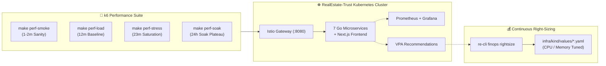

# ⚡ RealEstate-Trust: Performance, Capacity & 24-Hour Soak Testing Guide

An institutional guide to performance verification, saturation threshold discovery, long-duration soak testing, and empirical Kubernetes workload right-sizing for the **RealEstate-Trust Platform**.

---

## 🎯 Objectives & Architecture

The performance testing framework fulfills three critical engineering requirements:
1. **Capacity & Throughput Discovery**: Determines the exact requests-per-second (RPS) and concurrency ceilings achievable given a specific cluster configuration ($X$ CPU cores and $Y$ GB RAM).
2. **24-Hour Soak & Memory Leak Detection**: Verifies that microservices, PostgreSQL connections, RabbitMQ channels, and Istio sidecar proxies maintain rock-solid stability under sustained load with zero memory creep.
3. **Empirical Workload Sizing**: Replaces speculative CPU/memory guesswork by feeding empirical $p95$ and $p99$ telemetry from long-running tests directly into the **Vertical Pod Autoscaler (VPA)**, **OpenCost**, and our automated **`re-cli finops rightsize`** engine.



---

## 📊 Test Hierarchy

| Target | Command | Duration | Concurrency (VUs) | Primary Goal |
| :--- | :--- | :---: | :---: | :--- |
| **Smoke Test** | `make perf-smoke` | 1 minute | 3 VUs | Verifies route connectivity, JWT auth flow, and basic endpoint availability. |
| **Standard Load** | `make perf-load` | 12 minutes | 20 VUs (~50 RPS) | Establishes standard production baseline $p95$ and $p99$ latency SLAs. |
| **Stress & Saturation** | `make perf-stress` | 23 minutes | Up to 200 VUs (300+ RPS) | Ramps past capacity to find breaking points, queue buildup, and bottleneck services. |
| **24-Hour Sustained Soak** | `make perf-soak` | 24 hours | 50 VUs sustained | Sustained peak plateau to detect memory leaks, connection pool exhaustion, and long-term degradation. |

---

## 🚀 Running Performance Tests

Tests can be executed with **zero host dependencies** (using the official `grafana/k6:latest` container) or using a local `k6` binary if installed.

### 1. Smoke Test (Sanity)
```bash
make perf-smoke
```

### 2. Standard Load Test
```bash
make perf-load
```

### 3. Stress / Breaking Point Test
```bash
make perf-stress
```

### 4. 24-Hour Sustained Soak Test
By default, `make perf-soak` runs a 24-hour cycle:
- **1 Hour**: Gradual ramp-up to peak load
- **22 Hours**: Sustained maximum plateau
- **1 Hour**: Gradual ramp-down to zero

```bash
make perf-soak
```

#### Custom Soak Test Duration (Validation Dry-Runs)
You can customize the soak durations via environment variables for rapid validation:
```bash
# Example: 10-minute soak validation run (1m ramp, 8m plateau, 1m cooldown)
SOAK_RAMP=1m SOAK_PLATEAU=8m SOAK_COOLDOWN=1m SOAK_TARGET_VUS=25 make perf-soak
```

---

## 📈 Monitoring Live Telemetry During Runs

While the test is executing, monitor real-time behavior via the built-in observability stack:

* **Unified Gateway Portal**: `http://localhost:8080`
* **Grafana Dashboards**: `http://localhost:8080/grafana/` (User: `admin`, Password: run `make grafana-password`)
  * *Kubernetes / Compute Resources / Pod*: Inspect CPU and memory slopes over time to detect memory leaks.
  * *Istio Service Mesh*: Inspect HTTP request volume, error rates, and $p95$/$p99$ response times per microservice.
* **Kiali Mesh Visualizer**: `http://localhost:8080/kiali/`
* **Prometheus Metrics**: `http://localhost:8080/prometheus/`

---

## 🔄 Translating Soak Results into Optimal Pod Resources

Once the sustained load test has run, you can extract exact CPU and Memory recommendations:

### 1. Inspect Vertical Pod Autoscaler (VPA)
Query the in-cluster VPA recommendations:
```bash
kubectl get vpa -n realestate-trust
```

Output displays the empirically derived sizing recommendations:
```
NAME                          MODE   CPU     MEM       AGE
transaction-manager-vpa       Off    52m     68Mi      12h
identity-service-vpa          Off    45m     62Mi      12h
property-registry-service-vpa Off    35m     54Mi      12h
tokenization-engine-vpa       Off    40m     58Mi      12h
ledger-service-vpa            Off    38m     52Mi      12h
financing-engine-vpa          Off    32m     48Mi      12h
feedback-service-vpa          Off    25m     40Mi      12h
```

### 2. Preview and Apply Automated Right-Sizing
Run our FinOps CLI engine, which ingests the empirical peak data, adds a **+20% safety headroom**, sets memory limits at 1.5x, and preserves YAML formatting:
```bash
# Dry-run preview
make finops-rightsize-dryrun

# Apply changes to infra/kind/values/*.yaml
make finops-rightsize
```

### 3. GitOps Deployment
Commit the updated values. ArgoCD automatically syncs the newly tuned CPU and memory allocations to the cluster.
