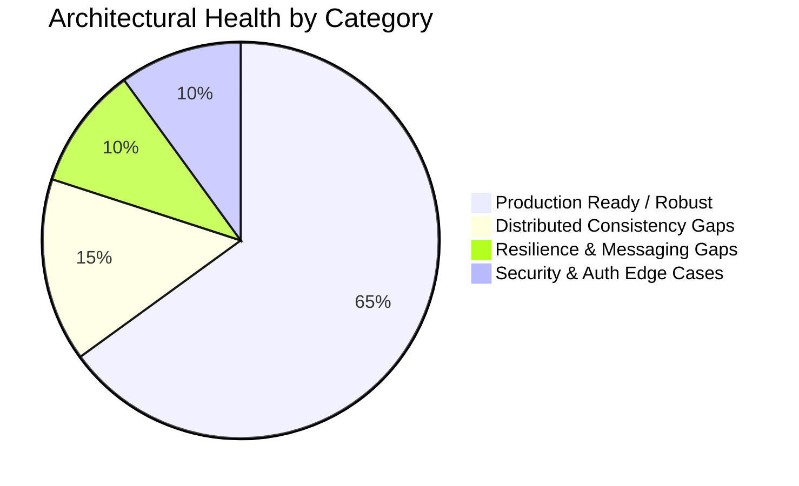
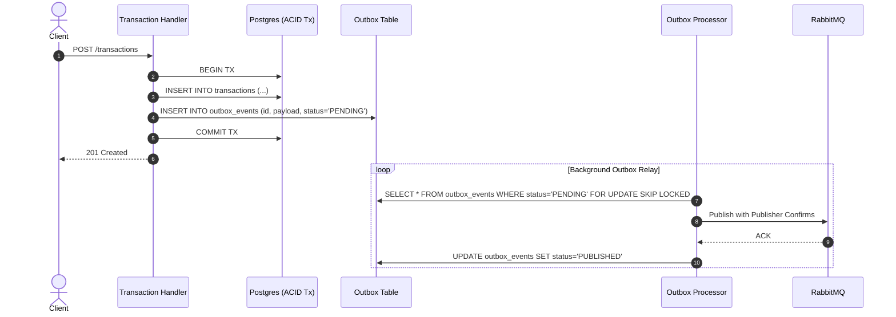
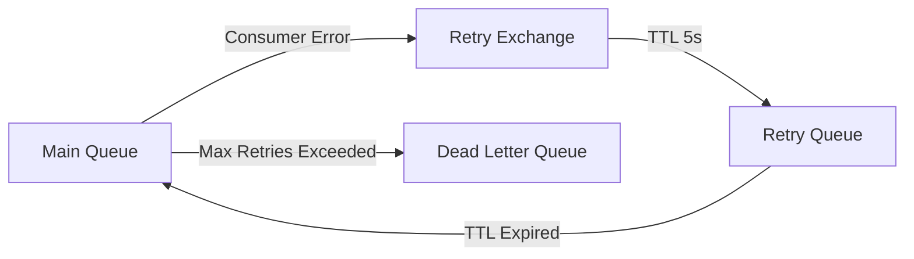
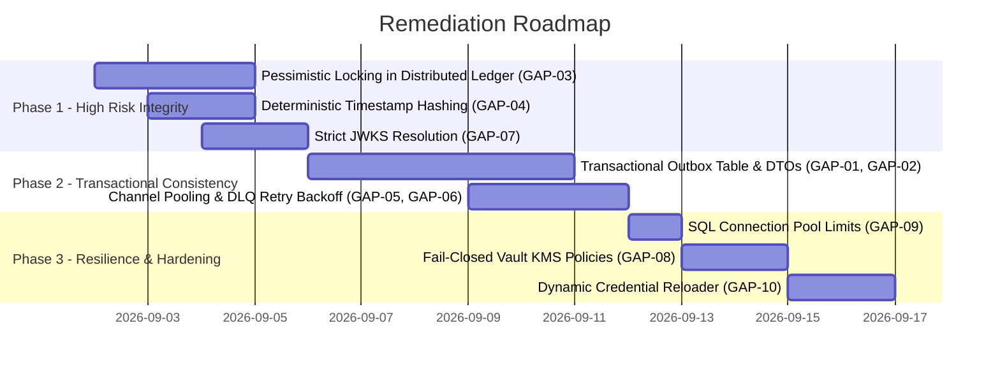

# Architectural Gaps & Distributed Design Patterns Review

## Executive Summary

This document captures the comprehensive **Architectural Gap Analysis** for the **RealEstate-Trust** monorepo based on modern distributed systems design principles, Clean Architecture, and microservices best practices.

The platform architecture consists of:
- **6 Domain Services**: `identity-service`, `property-registry-service`, `transaction-manager`, `financing-engine`, `tokenization-engine`, `ledger-service`.
- **Infrastructure**: HashiCorp Vault (Transit KMS + Dynamic DB Engine), Keycloak (OIDC/OAuth2), PostgreSQL (per-service isolation), RabbitMQ (Event Bus), Istio Service Mesh, and ArgoCD GitOps on Kubernetes (Kind).

---

## Architectural Health & Gap Overview



| ID | Gap / Vulnerability | Area | Severity | Recommended Design Pattern |
| :--- | :--- | :--- | :--- | :--- |
| **GAP-01** | Dual-Write & Event Loss Vulnerability | Microservices / Transactions | 🔴 **CRITICAL** | **Transactional Outbox Pattern** + CDC / Debezium / Polling Relay |
| **GAP-02** | Unstructured String Event Payloads | Event Bus / Messaging | 🟠 **HIGH** | **CloudEvents Standard Schema** with Typed DTOs |
| **GAP-03** | In-Memory Mutex in Distributed Ledger | Ledger / Immutability | 🔴 **CRITICAL** | **PostgreSQL Row-Locking (`FOR UPDATE`) / Atomic Sequence** |
| **GAP-04** | Non-Deterministic Hash on Monotonic Clock | Ledger / Cryptography | 🟠 **HIGH** | **Deterministic UTC RFC3339 Timestamp Hashing** |
| **GAP-05** | AMQP Channel Churn per Publish | RabbitMQ / Messaging | 🟡 **MEDIUM** | **Publisher Channel Pooling / Long-Lived Channel** |
| **GAP-06** | Immediate DLQ Routing without Retry Backoff | RabbitMQ / Consumers | 🟡 **MEDIUM** | **Exponential Backoff & Retry Exchange Pattern** |
| **GAP-07** | JWKS Unknown Key Fallback Loophole | Security / IAM | 🟠 **HIGH** | **Strict `kid` Matching & Explicit Cache Eviction** |
| **GAP-08** | Silent Fallback from Vault Transit to Local Key | Security / KMS | 🟠 **HIGH** | **Fail-Closed Encryption & KMS Alerting** |
| **GAP-09** | Unbounded SQL Connection Pooling | Database / Persistence | 🟡 **MEDIUM** | **Explicit Connection Pool Bounds (`SetMaxOpenConns`)** |
| **GAP-10** | Dynamic Database Credential Rotation Gap | Database / Vault | 🟡 **MEDIUM** | **Reloader Sidecar / Dynamic DB Reconnection Hook** |

---

## Detailed Gap Analysis & Remediation Patterns

---

### GAP-01: Dual-Write & Event Loss Vulnerability
- **Component**: [`internal/db/transaction_handlers.go`](file:///Users/nitishshanchinagoudra/workspace/me/realestate-trust/internal/db/transaction_handlers.go#L43-L55)
- **Severity**: 🔴 **CRITICAL**

#### Problem Statement
In `CreateTransaction`, `UpdateStatus`, and `FundEscrow`, the handler commits state directly to PostgreSQL via `h.Repo.CreateTransaction(...)`, and subsequently triggers an asynchronous RabbitMQ publish:
```go
tx, err := h.Repo.CreateTransaction(req.PropertyID, req.BuyerID, req.SellerID, req.TotalAmount)
if err != nil {
    return c.JSON(http.StatusInternalServerError, ...)
}

if h.RabbitConn != nil {
    _ = events.Publish(c.Request().Context(), h.RabbitConn, "transaction-events", events.TransactionEvent{...})
}
```

#### Why This Is a Critical Risk
1. **Dual-Write Hazard**: If the service pod crashes, network partitions occur, or RabbitMQ is momentarily unreachable *after* the DB commit, the event is permanently lost while the transaction remains committed in Postgres. Downstream subscribers (`ledger-service`, accounting, auditing) will become permanently out of sync.
2. **Ignored Error**: The call explicitly discards the return value (`_ = events.Publish`), meaning publishers fail silently under partition scenarios.

#### Recommended Design Pattern: Transactional Outbox Pattern
Commit the domain entity and the outgoing event in the **exact same ACID database transaction** into an `outbox` table. A background publisher or CDC (Change Data Capture) worker then relays events to RabbitMQ with guaranteed at-least-once delivery.



---

### GAP-02: Unstructured String Event Payloads
- **Component**: [`internal/events/rabbitmq.go`](file:///Users/nitishshanchinagoudra/workspace/me/realestate-trust/internal/events/rabbitmq.go#L17-L22), [`internal/db/transaction_handlers.go`](file:///Users/nitishshanchinagoudra/workspace/me/realestate-trust/internal/db/transaction_handlers.go#L52)
- **Severity**: 🟠 **HIGH**

#### Problem Statement
`TransactionEvent` encodes payloads as arbitrary formatted strings:
```go
Payload: "Transaction Created: " + tx.ID + " - " + strconv.FormatFloat(tx.TotalAmount, 'f', 2, 64) + " INR"
```

#### Why This Is a High Risk
1. Downstream microservices (`ledger-service`, `financing-engine`) cannot deserialize typed properties (`amount`, `buyer_id`, `property_id`) without fragile string parsing/regex.
2. Changes to string formatting break all downstream consumers without compiler or schema validation warnings.

#### Recommended Design Pattern: CloudEvents Standard / Strongly-Typed JSON DTOs
Define explicit, versioned event schemas adhering to CNCF CloudEvents:
```go
type EventEnvelope[T any] struct {
    SpecVersion string    `json:"specversion"` // "1.0"
    ID          string    `json:"id"`
    Source      string    `json:"source"`      // "realestate-trust/transaction-manager"
    Type        string    `json:"type"`        // "com.realestatetrust.transaction.created.v1"
    Time        time.Time `json:"time"`
    Data        T         `json:"data"`
}

type TransactionCreatedData struct {
    TransactionID string  `json:"transactionId"`
    PropertyID    string  `json:"propertyId"`
    BuyerID       string  `json:"buyerId"`
    SellerID      string  `json:"sellerId"`
    Amount        float64 `json:"amount"`
    Currency      string  `json:"currency"`
}
```

---

### GAP-03: In-Memory Mutex in Distributed Ledger
- **Component**: [`internal/db/ledger_repository_sql.go`](file:///Users/nitishshanchinagoudra/workspace/me/realestate-trust/internal/db/ledger_repository_sql.go#L14-L24)
- **Severity**: 🔴 **CRITICAL**

#### Problem Statement
`SQLLedgerRepository` uses a local Go `sync.Mutex` to synchronize hash computations and calculate the next `log_index`:
```go
type SQLLedgerRepository struct {
    db *sql.DB
    mu sync.Mutex // In-memory mutex
}
```

#### Why This Is a Critical Risk
- In Kubernetes, `ledger-service` is deployed as a Deployment and autoscaled by KEDA.
- When 2 or more replicas run simultaneously, the in-memory `sync.Mutex` **only protects a single pod**.
- Concurrent pods consuming from RabbitMQ will read the exact same `lastIndex` and `lastHash`, creating **hash chain forks, duplicate indexes, and ledger verification failures**.

#### Recommended Design Pattern: Pessimistic Table/Row Locking or Atomic DB Sequence
Execute hash generation within an explicit PostgreSQL transaction with table-level row lock:
```sql
BEGIN;
SELECT log_index, hash FROM ledger_entries ORDER BY log_index DESC LIMIT 1 FOR UPDATE;
-- Compute new hash
INSERT INTO ledger_entries (log_index, timestamp, payload, previous_hash, hash, event_id)
VALUES ($1, $2, $3, $4, $5, $6);
COMMIT;
```

---

### GAP-04: Non-Deterministic Hash on Monotonic Clock
- **Component**: [`internal/core/ledger.go`](file:///Users/nitishshanchinagoudra/workspace/me/realestate-trust/internal/core/ledger.go#L20-L25)
- **Severity**: 🟠 **HIGH**

#### Problem Statement
`AuditEntry.CalculateHash()` formats timestamps using `e.Timestamp.String()`:
```go
func (e *AuditEntry) CalculateHash() string {
    record := fmt.Sprintf("%d%s%s%s%s", e.Index, e.Timestamp.String(), e.Payload, e.PreviousHash, e.EventID)
    h := sha256.New()
    h.Write([]byte(record))
    return hex.EncodeToString(h.Sum(nil))
}
```

#### Why This Is a High Risk
In Go, `time.Time.String()` includes monotonic clock readings (`m=±...`) when instantiated in memory via `time.Now()`. When the entry is written to PostgreSQL and retrieved back, the monotonic component is lost. Re-verifying the ledger chain from the database produces a different hash, causing false tampering alerts.

#### Recommended Design Pattern: Canonical Deterministic Timestamp Formatting
```go
func (e *AuditEntry) CalculateHash() string {
    canonicalTime := e.Timestamp.UTC().Format(time.RFC3339Nano)
    record := fmt.Sprintf("%d|%s|%s|%s|%s", e.Index, canonicalTime, e.Payload, e.PreviousHash, e.EventID)
    sum := sha256.Sum256([]byte(record))
    return hex.EncodeToString(sum[:])
}
```

---

### GAP-05: AMQP Channel Churn per Publish
- **Component**: [`internal/events/rabbitmq.go`](file:///Users/nitishshanchinagoudra/workspace/me/realestate-trust/internal/events/rabbitmq.go#L98-L115)
- **Severity**: 🟡 **MEDIUM**

#### Problem Statement
On every single message publish, `events.Publish`:
1. Opens a new AMQP channel (`conn.Channel()`).
2. Declares DLX, DLQ, and Queue topology (`setupQueue()`).
3. Sets up publisher confirms (`ch.Confirm()`).
4. Closes the channel upon exit (`defer ch.Close()`).

#### Why This Is a Risk
AMQP channel opening and closing requires network round-trips (frames). Under peak load, this creates high socket churn and latency overhead.

#### Recommended Design Pattern: Long-Lived Publisher Channel Pool
Maintain a dedicated, long-lived AMQP publishing channel with pre-initialized topology at service startup.

---

### GAP-06: Immediate DLQ Routing without Retry Backoff
- **Component**: [`internal/events/rabbitmq.go`](file:///Users/nitishshanchinagoudra/workspace/me/realestate-trust/internal/events/rabbitmq.go#L214-L218)
- **Severity**: 🟡 **MEDIUM**

#### Problem Statement
In `Consume()`, when `handler(ctx, event)` returns any error:
```go
if err := handler(ctx, event); err != nil {
    slog.ErrorContext(ctx, "failed to handle message", "err", err)
    _ = d.Nack(false, false) // Immediately sent to Dead Letter Queue
}
```

#### Why This Is a Risk
Transient issues (e.g., temporary database lock, network timeout, or cold container) immediately dump messages into the DLQ on attempt #1, requiring manual operator intervention.

#### Recommended Design Pattern: Dead-Letter Exchange (DLX) with Retry Queue (TTL Delay)
Implement a retry exchange with a TTL delay and retry count header (e.g., 3 retries with 5s backoff) before routing permanently to the DLQ.



---

### GAP-07: JWKS Unknown Key Fallback Loophole
- **Component**: [`internal/db/jwks.go`](file:///Users/nitishshanchinagoudra/workspace/me/realestate-trust/internal/db/jwks.go#L90-L94)
- **Severity**: 🟠 **HIGH**

#### Problem Statement
In `JWKSClient.GetKey`:
```go
key, exists = c.keys[kid]
if !exists {
    for _, k := range c.keys {
        return k, nil // Fallback to random cached key!
    }
    return nil, fmt.Errorf("unable to find public key for kid: %s", kid)
}
```

#### Why This Is a High Risk
If a token has an unknown or rotated `kid`, the client arbitrarily selects the first public key in its cache. If the realm contains multiple keys, signature verification yields undefined or intermittent behavior.

#### Recommended Design Pattern: Strict Key ID Resolution & Force Cache Refresh
If `kid` is missing from cache, trigger a forced refresh from Keycloak. If still not found after refresh, immediately reject the token with `ErrKeyNotFound`.

---

### GAP-08: Silent Fallback from Vault Transit to Local Key
- **Component**: [`internal/db/crypto.go`](file:///Users/nitishshanchinagoudra/workspace/me/realestate-trust/internal/db/crypto.go#L36-L44)
- **Severity**: 🟠 **HIGH**

#### Problem Statement
In `EncryptKYC`:
```go
if vaultAddr != "" && vaultToken != "" {
    ciphertext, err := encryptWithVault(vaultAddr, vaultToken, plaintext)
    if err == nil {
        return ciphertext, nil
    }
}
return encryptLocal(plaintext) // Silent local fallback
```

#### Why This Is a High Risk
If Vault Transit KMS is unreachable or token expires in production, encryption degrades to local AES-GCM with a developer key silently without raising alert metrics or failing fast.

#### Recommended Design Pattern: Strict Environment Separation (Fail-Closed in Production)
In staging/production environments (`ENV != "development"`), cryptographic calls must **fail closed** if the enterprise KMS/Vault is unreachable.

---

### GAP-09: Unbounded SQL Connection Pooling
- **Component**: [`internal/db/db.go`](file:///Users/nitishshanchinagoudra/workspace/me/realestate-trust/internal/db/db.go#L22-L32)
- **Severity**: 🟡 **MEDIUM**

#### Problem Statement
`sql.Open("postgres", connStr)` creates a `*sql.DB` instance without setting connection pool constraints:
- `SetMaxOpenConns`
- `SetMaxIdleConns`
- `SetConnMaxLifetime`
- `SetConnMaxIdleTime`

#### Why This Is a Risk
Under sudden request spikes or autoscaling, microservices will open unlimited connections to PostgreSQL, exhausting PostgreSQL's `max_connections` (default 100).

#### Recommended Design Pattern: Standardized Connection Pool Configuration
```go
db.SetMaxOpenConns(25)
db.SetMaxIdleConns(10)
db.SetConnMaxLifetime(15 * time.Minute)
db.SetConnMaxIdleTime(5 * time.Minute)
```

---

### GAP-10: Dynamic Database Credential Rotation Gap
- **Component**: Microservices / HashiCorp Vault Database Engine
- **Severity**: 🟡 **MEDIUM**

#### Problem Statement
Vault generates dynamic, short-lived PostgreSQL database credentials synced to Kubernetes secrets via External Secrets Operator (ESO). The Go application reads `DATABASE_URL` once upon process initialization.

#### Why This Is a Risk
When Vault dynamic credentials expire and rotate, existing DB connections in the Go `*sql.DB` pool will fail authentication once the lease is revoked, requiring a pod restart.

#### Recommended Design Pattern: Stakater Reloader / In-App Credential Watcher
Use **Stakater Reloader** in GitOps to perform rolling restarts when secret updates occur, or configure dynamic connection pool re-authentication hooks.

---

## Suggested Phased Implementation Roadmap



---

## Summary Table for Tracking

| Phase | Target Gaps | Expected Outcome |
| :--- | :--- | :--- |
| **Phase 1: Immutability & Auth** | GAP-03, GAP-04, GAP-07 | Multi-replica safe ledger chain, tamper-proof hashes, strict JWT signature enforcement. |
| **Phase 2: Event Consistency** | GAP-01, GAP-02, GAP-05, GAP-06 | Zero event loss during network partitions, typed CloudEvents, AMQP retry queues. |
| **Phase 3: Security & DB Hardening** | GAP-08, GAP-09, GAP-10 | Fail-closed KMS, bounded DB connections, automatic lease rotation restarts. |
