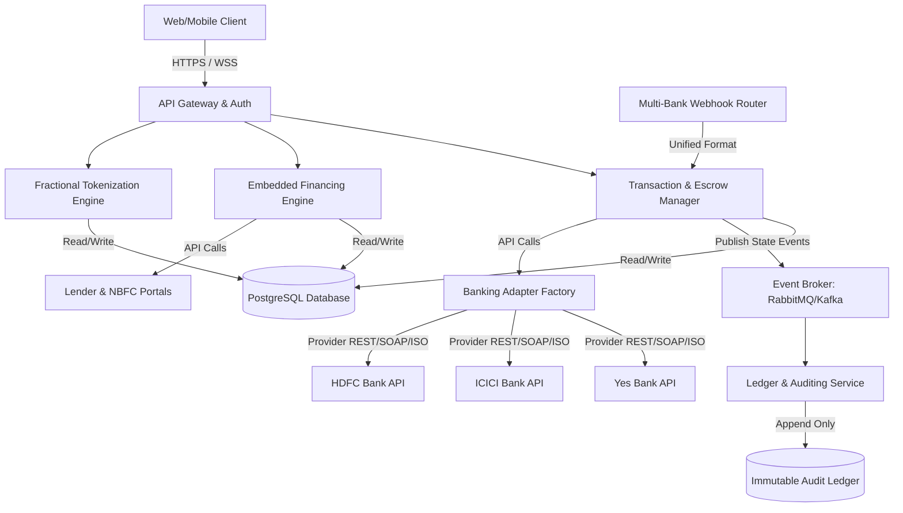
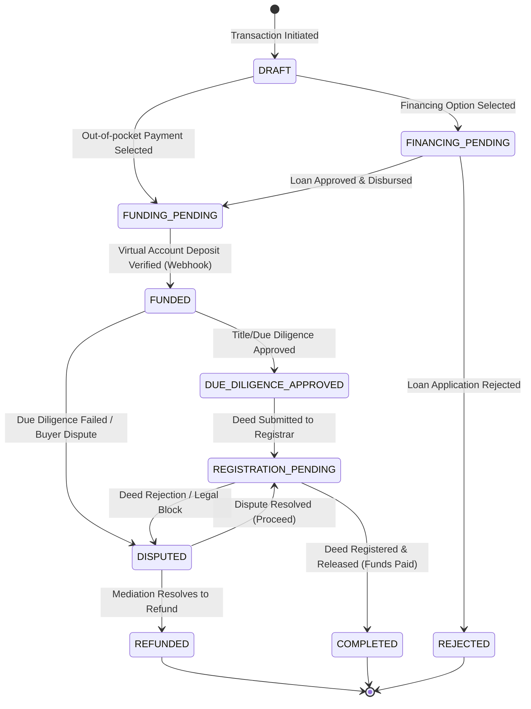

# Real Estate Trust & Escrow Platform Architecture

This document outlines the system architecture, transactional state machine, database schema, API contracts, and security controls for the **Real Estate Trust & Escrow Platform**.

Unlike typical e-commerce payments, real estate transactions deal with high-value capital, multi-party legal sign-offs, external banking virtual accounts, and fractional investments. The system is designed around a strict, auditable transaction ledger and a robust state machine.

---

## 1. System & Microservices Architecture

The platform is designed as an event-driven microservices architecture to ensure high availability, auditability, and clear separation of concerns.



### Microservices Definitions

1. **Transaction & Escrow Manager (The Core Payment Engine)**
   - **Language**: Go (Golang)
   - Responsible for creating transaction workflows, binding them to property deeds, and handling escrow agreements.
   - Communicates with banking APIs to spawn dedicated **Virtual Accounts (VA)** for each deal.
   - Coordinates multi-party approvals (Buyer, Seller, Title Officer, Registrar).
   - Incorporates a **Banking Adapter Factory** to abstract multi-bank connectivity (Yes Bank, ICICI Bank, HDFC Bank, etc.).

2. **Embedded Financing Engine**
   - **Language**: Go (Golang)
   - Integrates with NBFCs and banks to orchestrate loan applications, credit profiling, and mortgage underwriting.
   - Coordinates direct disbursement of approved loan funds into the Escrow Virtual Account.

3. **Fractional Tokenization Engine**
   - **Language**: Go (Golang)
   - Handles the split ownership pools of high-value plots/commercial properties.
   - Distributes payouts, registers token purchase ledger transactions, and tracks fractional share capitalization tables.

4. **Ledger & Auditing Service (Trust Layer)**
   - **Language**: Go (Golang)
   - An independent, append-only service that records every financial state change, deposit, release, and legal verification. It generates cryptographic hash chains to ensure historical integrity.

### Banking Partner Integration Architecture (Go Adapter Pattern)

To avoid tight coupling to any single financial institution, the platform defines a unified **Banking Service Adapter Interface** in Go. All partner bank integrations must implement this interface:

```go
package banking

import "context"

type BankAccount struct {
	AccountNumber string `json:"account_number"`
	IFSCCode      string `json:"ifsc_code"`
	BankName      string `json:"bank_name"`
}

type VirtualAccountDetails struct {
	VirtualAccountNumber string  `json:"virtual_account_number"`
	IFSCCode             string  `json:"ifsc_code"`
	BankName             string  `json:"bank_name"`
	TargetAmount         float64 `json:"target_amount"`
}

type PayoutReceipt struct {
	UTR            string  `json:"utr"`
	AmountReleased float64 `json:"amount_released"`
	Status         string  `json:"status"`
}

type IBankingAdapter interface {
	// CreateVirtualAccount spawns a unique virtual account dedicated to an escrow transaction
	CreateVirtualAccount(ctx context.Context, transactionID string, targetAmount float64) (*VirtualAccountDetails, error)

	// FetchBalance fetches real-time transaction history and current balance of a virtual account
	FetchBalance(ctx context.Context, virtualAccountNumber string) (float64, error)

	// InitiatePayout triggers disbursement/payout of funds from the escrow VA to the seller's account
	InitiatePayout(ctx context.Context, virtualAccountNumber string, destinationAccount BankAccount, amount float64) (*PayoutReceipt, error)

	// ValidateWebhookSignature verifies the authenticity of incoming webhook messages using bank-specific credentials
	ValidateWebhookSignature(ctx context.Context, rawBody []byte, signature string, secret string) bool
}
```

By coding against this interface, the Transaction Manager can swap, route, or failover between banking partners without modifying the core escrow workflow logic.

---

## 2. Escrow State Machine

A real estate escrow account has a complex lifecycle. Funds must be locked, verified, and only released after strict due diligence and title transfer verifications are complete.



### State Definitions & Transition Rules

| Source State | Destination State | Triggering Action / Event | Validation Rules / Requirements |
| :--- | :--- | :--- | :--- |
| `DRAFT` | `FINANCING_PENDING` | Buyer selects "Embedded Financing" and submits application details. | Loan amount + downpayment must equal total transaction amount. |
| `DRAFT` | `FUNDING_PENDING` | Buyer skips financing and commits to 100% out-of-pocket escrow payment. | Virtual escrow account successfully created via Bank API. |
| `FINANCING_PENDING` | `FUNDING_PENDING` | Bank/NBFC API issues callback confirming loan approval and escrow deposit schedule. | Bank's digital approval token must be verified. |
| `FUNDING_PENDING` | `FUNDED` | Bank Webhook triggers confirming 100% of transaction value is locked in Virtual Account. | Reconciled balance must match exactly the escrow agreement amount. |
| `FUNDED` | `DUE_DILIGENCE_APPROVED` | Title Verification Officer signs off on title reports. | Digital signature of verified surveyor/lawyer must match registered platform credentials. |
| `DUE_DILIGENCE_APPROVED`| `REGISTRATION_PENDING`| Sale deed executed and submitted to Sub-Registrar Office (SRO). | SRO challan receipt or digital application number uploaded. |
| `REGISTRATION_PENDING` | `COMPLETED` | Registration confirmed via land registry API or registrar document verification. | Deed registration verified; funds automatically triggered for release to Seller. |
| `* (Any)` | `DISPUTED` | Buyer, Seller, or escrow agent raises a legal issue or title discrepancy. | Locks escrow funds; requires manual mediation or judicial decision. |
| `DISPUTED` | `REFUNDED` | Legal mediator issues settlement decree to return funds to buyer. | Escrow release instructions signed by both parties or a court decree. |

---

## 3. Database Schema Design (PostgreSQL)

To enforce consistency and auditability, we use PostgreSQL with foreign key constraints, numeric scales for money representation, and index optimizations on transaction states.

```sql
-- User Roles & Profiles
CREATE TYPE user_role AS ENUM ('BUYER', 'SELLER', 'INVESTOR', 'LENDER', 'VERIFIER', 'ADMIN');
CREATE TYPE kyc_status AS ENUM ('PENDING', 'APPROVED', 'REJECTED');

CREATE TABLE users (
    id UUID PRIMARY KEY DEFAULT gen_random_uuid(),
    email VARCHAR(255) UNIQUE NOT NULL,
    phone VARCHAR(20) UNIQUE NOT NULL,
    full_name VARCHAR(255) NOT NULL,
    role user_role NOT NULL DEFAULT 'BUYER',
    kyc_status kyc_status NOT NULL DEFAULT 'PENDING',
    bank_account_details JSONB, -- Encrypted details (IFS Code, Account Num, Bank)
    created_at TIMESTAMP WITH TIME ZONE DEFAULT CURRENT_TIMESTAMP,
    updated_at TIMESTAMP WITH TIME ZONE DEFAULT CURRENT_TIMESTAMP
);

-- Properties Listed for Purchase or Fractional Investments
CREATE TABLE properties (
    id UUID PRIMARY KEY DEFAULT gen_random_uuid(),
    owner_id UUID REFERENCES users(id) ON DELETE RESTRICT,
    title VARCHAR(255) NOT NULL,
    description TEXT,
    location VARCHAR(255) NOT NULL,
    google_maps_url VARCHAR(512),
    valuation NUMERIC(15, 2) NOT NULL, -- e.g. 10000000.00 (1 Crore)
    fractional_eligible BOOLEAN NOT NULL DEFAULT FALSE,
    deed_registration_number VARCHAR(100),
    created_at TIMESTAMP WITH TIME ZONE DEFAULT CURRENT_TIMESTAMP
);

-- Banking Partners Configuration
CREATE TABLE bank_partners (
    id UUID PRIMARY KEY DEFAULT gen_random_uuid(),
    name VARCHAR(100) UNIQUE NOT NULL, -- e.g. 'Yes Bank', 'ICICI Bank', 'HDFC Bank'
    provider_slug VARCHAR(50) UNIQUE NOT NULL, -- e.g. 'yes_bank', 'icici', 'hdfc'
    api_base_url VARCHAR(255) NOT NULL,
    webhook_secret_arn VARCHAR(255), -- Reference to secure credentials store
    is_active BOOLEAN NOT NULL DEFAULT TRUE,
    created_at TIMESTAMP WITH TIME ZONE DEFAULT CURRENT_TIMESTAMP,
    updated_at TIMESTAMP WITH TIME ZONE DEFAULT CURRENT_TIMESTAMP
);

-- Escrow Accounts mapping to Banking Virtual Accounts
CREATE TYPE escrow_status AS ENUM ('ACTIVE', 'LOCKED', 'RELEASED', 'REFUNDED');

CREATE TABLE escrow_accounts (
    id UUID PRIMARY KEY DEFAULT gen_random_uuid(),
    bank_partner_id UUID NOT NULL REFERENCES bank_partners(id) ON DELETE RESTRICT,
    virtual_account_number VARCHAR(50) UNIQUE NOT NULL,
    ifsc_code VARCHAR(15) NOT NULL,
    status escrow_status NOT NULL DEFAULT 'ACTIVE',
    target_amount NUMERIC(15, 2) NOT NULL,
    balance NUMERIC(15, 2) NOT NULL DEFAULT 0.00,
    created_at TIMESTAMP WITH TIME ZONE DEFAULT CURRENT_TIMESTAMP,
    updated_at TIMESTAMP WITH TIME ZONE DEFAULT CURRENT_TIMESTAMP
);

-- Core Transactions
CREATE TYPE transaction_state AS ENUM (
    'DRAFT', 'FINANCING_PENDING', 'FUNDING_PENDING', 'FUNDED',
    'DUE_DILIGENCE_APPROVED', 'REGISTRATION_PENDING', 'COMPLETED',
    'REFUNDED', 'DISPUTED'
);

CREATE TABLE transactions (
    id UUID PRIMARY KEY DEFAULT gen_random_uuid(),
    property_id UUID REFERENCES properties(id) ON DELETE RESTRICT,
    buyer_id UUID REFERENCES users(id) ON DELETE RESTRICT,
    seller_id UUID REFERENCES users(id) ON DELETE RESTRICT,
    escrow_account_id UUID REFERENCES escrow_accounts(id) ON DELETE RESTRICT,
    total_amount NUMERIC(15, 2) NOT NULL,
    state transaction_state NOT NULL DEFAULT 'DRAFT',
    created_at TIMESTAMP WITH TIME ZONE DEFAULT CURRENT_TIMESTAMP,
    updated_at TIMESTAMP WITH TIME ZONE DEFAULT CURRENT_TIMESTAMP
);

-- Financing Applications for Embedded Financing
CREATE TYPE financing_status AS ENUM ('APPLIED', 'APPROVED', 'DISBURSED', 'REJECTED');

CREATE TABLE financing_applications (
    id UUID PRIMARY KEY DEFAULT gen_random_uuid(),
    transaction_id UUID REFERENCES transactions(id) ON DELETE CASCADE,
    lender_id UUID REFERENCES users(id) ON DELETE RESTRICT,
    applied_amount NUMERIC(15, 2) NOT NULL,
    approved_amount NUMERIC(15, 2),
    interest_rate NUMERIC(5, 2), -- e.g. 8.75 (%)
    status financing_status NOT NULL DEFAULT 'APPLIED',
    created_at TIMESTAMP WITH TIME ZONE DEFAULT CURRENT_TIMESTAMP,
    updated_at TIMESTAMP WITH TIME ZONE DEFAULT CURRENT_TIMESTAMP
);

-- Fractional Tokenization Pools
CREATE TABLE fractional_pools (
    id UUID PRIMARY KEY DEFAULT gen_random_uuid(),
    property_id UUID REFERENCES properties(id) ON DELETE CASCADE,
    total_shares BIGINT NOT NULL, -- e.g., 1000 shares
    share_price NUMERIC(15, 2) NOT NULL, -- e.g., 100000.00 (1 Lakh per share)
    available_shares BIGINT NOT NULL,
    created_at TIMESTAMP WITH TIME ZONE DEFAULT CURRENT_TIMESTAMP
);

-- Fractional Holdings mapping investors to shares
CREATE TABLE fractional_holdings (
    id UUID PRIMARY KEY DEFAULT gen_random_uuid(),
    pool_id UUID REFERENCES fractional_pools(id) ON DELETE CASCADE,
    investor_id UUID REFERENCES users(id) ON DELETE RESTRICT,
    shares_owned BIGINT NOT NULL CHECK (shares_owned > 0),
    amount_invested NUMERIC(15, 2) NOT NULL,
    created_at TIMESTAMP WITH TIME ZONE DEFAULT CURRENT_TIMESTAMP,
    CONSTRAINT unique_investor_pool UNIQUE(pool_id, investor_id)
);

-- Immutable Transaction Ledger (Trust Audit Layer)
CREATE TABLE transaction_ledger (
    id BIGSERIAL PRIMARY KEY,
    transaction_id UUID REFERENCES transactions(id) ON DELETE CASCADE,
    state_from transaction_state NOT NULL,
    state_to transaction_state NOT NULL,
    actor_id UUID REFERENCES users(id),
    action_description TEXT NOT NULL,
    previous_hash VARCHAR(64), -- Cryptographic chaining
    current_hash VARCHAR(64) UNIQUE NOT NULL,
    created_at TIMESTAMP WITH TIME ZONE DEFAULT CURRENT_TIMESTAMP
);
```

---

## 4. API Design & Specifications

All request and response bodies use JSON. Authentication is required via `Authorization: Bearer <JWT_TOKEN>`.

### 4.1 Initialize Escrow
Spawns a new transaction flow, configures the selected banking partner, creates an escrow virtual account record, and binds the agreement rules.

- **URL:** `/api/v1/escrow/initialize`
- **Method:** `POST`
- **Request Body:**
  ```json
  {
    "property_id": "9b1deb4d-3b7d-4bad-9bdd-2b0d7b3dcb6d",
    "buyer_id": "c3b9a7c6-7a1a-46be-8b26-bb2b2c9c7f66",
    "total_amount": 10000000.00,
    "payment_method": "OUT_OF_POCKET",
    "bank_partner_id": "2b2a1a0c-5d6e-7f8a-9b0c-1d2e3f4a5b6c" // Optional. If null, the platform selects via internal routing rules.
  }
  ```
- **Response (201 Created):**
  ```json
  {
    "transaction_id": "d03f5db9-6014-41d3-a3d2-40df48fe75e0",
    "escrow_account": {
      "bank_partner_id": "2b2a1a0c-5d6e-7f8a-9b0c-1d2e3f4a5b6c",
      "bank_name": "Yes Bank",
      "virtual_account_number": "VA77992019921",
      "ifsc_code": "YESB0000001",
      "status": "ACTIVE",
      "target_amount": 10000000.00
    },
    "state": "FUNDING_PENDING",
    "created_at": "2026-07-11T04:10:00Z"
  }
  ```

### 4.2 Apply for Embedded Financing
Allows a buyer to submit an application to a platform lender for loan approval.

- **URL:** `/api/v1/financing/apply`
- **Method:** `POST`
- **Request Body:**
  ```json
  {
    "transaction_id": "d03f5db9-6014-41d3-a3d2-40df48fe75e0",
    "lender_id": "5f9e8a7d-6c5b-4a3d-2e1f-0a9b8c7d6e5f",
    "applied_amount": 8000000.00
  }
  ```
- **Response (202 Accepted):**
  ```json
  {
    "application_id": "e0a1b2c3-d4e5-4f6a-7b8c-9d0e1f2a3b4c",
    "transaction_id": "d03f5db9-6014-41d3-a3d2-40df48fe75e0",
    "status": "APPLIED",
    "message": "Loan application forwarded to NBFC partner. State is now FINANCING_PENDING."
  }
  ```

### 4.3 Buy Fractional Shares
Allows micro-investments by buying property shares directly from a tokenization pool.

- **URL:** `/api/v1/tokenization/invest`
- **Method:** `POST`
- **Request Body:**
  ```json
  {
    "pool_id": "a1b2c3d4-e5f6-7a8b-9c0d-1e2f3a4b5c6d",
    "shares_to_buy": 10,
    "amount": 1000000.00
  }
  ```
- **Response (200 OK):**
  ```json
  {
    "holding_id": "f0e1d2c3-b4a5-9e8d-7c6b-5a4f3e2d1c0b",
    "shares_owned": 10,
    "amount_invested": 1000000.00,
    "remaining_available_shares": 990
  }
  ```

### 4.4 Verify Bank Deposit (Webhook)
Webhook callback from Bank APIs. Each bank points to a dynamic URL slug identifier. The router resolves the webhook handler based on the slug.

- **URL:** `/api/v1/webhooks/bank/{provider_slug}/deposit`
- **Method:** `POST`
- **Headers:** `X-Webhook-Signature: t=1789218221,v1=5e93fa23...`
- **Request Body (Normalized structure passed from bank-specific router middleware):**
  ```json
  {
    "virtual_account_number": "VA77992019921",
    "amount_received": 10000000.00,
    "utr": "UTRN88291038102",
    "timestamp": "2026-07-11T04:15:00Z"
  }
  ```
- **Response (200 OK):**
  ```json
  {
    "status": "success",
    "reconciled": true,
    "transaction_state": "FUNDED"
  }
  ```

### 4.5 Trigger Escrow Release
Initiates the release of funds to the seller after the legal sale deed is registered.

- **URL:** `/api/v1/escrow/release`
- **Method:** `POST`
- **Request Body:**
  ```json
  {
    "transaction_id": "d03f5db9-6014-41d3-a3d2-40df48fe75e0",
    "deed_registration_number": "REG-MUM-2026-9812",
    "sro_verification_hash": "a4d3f2c1b0e9f8"
  }
  ```
- **Response (200 OK):**
  ```json
  {
    "transaction_id": "d03f5db9-6014-41d3-a3d2-40df48fe75e0",
    "status": "COMPLETED",
    "amount_released": 10000000.00,
    "released_to_seller_account": "XXXXXX9821"
  }
  ```

---

## 5. Trust, Security & Auditing Layer

Real estate investments require robust mechanisms to ensure that no state change or monetary transaction is tampered with.

### 5.1 Immutable Ledger & Hash Chaining
The system keeps a sequential log of every lifecycle state transition. Whenever a transaction's state is modified, a record is added to the `transaction_ledger`. The `current_hash` is computed as:

$$\text{current\_hash} = \text{SHA256}(\text{transaction\_id} + \text{state\_from} + \text{state\_to} + \text{actor\_id} + \text{previous\_hash})$$

This creates a linked chain of audits. A periodic daemon recalculates the hashes to verify that none of the transaction records or history have been altered in the database.

### 5.2 Multi-Signature Approval Gates
To reach the `COMPLETED` state, multiple actors must sign off on the platform:
- **Buyer**: Sign-off confirming receipt of keys and title documents.
- **Seller**: Sign-off confirming handover.
- **Verifier (Platform/External Legal Auditor)**: Independent verification of the deed registry number with state government records (via digital APIs or manual validation checklist).

### 5.3 Webhook Security (Multi-Bank HMAC Validation)
To secure webhook calls for different banking partners:
1. When a webhook is received on `/api/v1/webhooks/bank/{provider_slug}/deposit`, the router extracts the slug.
2. The router queries `bank_partners` to fetch the configuration and API secret key ARN (e.g. from AWS Secrets Manager) corresponding to the `provider_slug`.
3. The platform computes the SHA256 HMAC of the request body using the retrieved secret and validates it against the header signature.
4. If valid, the payload is normalized by the corresponding bank-specific adapter middleware and processed by the transaction manager.

---

## 6. Containerization & Kubernetes Deployment Specification

All services are containerized using minimal, multi-stage Docker builds optimized for security and size, and deployed on a Kubernetes cluster.

### 6.1 Multi-Stage Dockerfile for Go Services
A typical Dockerfile configuration for building and running a microservice (e.g., `transaction-manager`):

```dockerfile
# Build stage
FROM golang:1.21-alpine AS builder

WORKDIR /app

# Copy dependency files and fetch dependencies
COPY go.mod go.sum ./
RUN go mod download

# Copy source code and build statically linked executable
COPY . .
RUN CGO_ENABLED=0 GOOS=linux go build -ldflags="-w -s" -o transaction-manager cmd/server/main.go

# Run stage
FROM alpine:3.18

RUN apk --no-cache add ca-certificates tzdata

WORKDIR /root/

# Copy binary from build stage
COPY --from=builder /app/transaction-manager .

# Expose port and run
EXPOSE 8080
CMD ["./transaction-manager"]
```

### 6.2 Kubernetes Manifests Example
Standard Kubernetes deployment descriptors for hosting the containerized microservices in high-availability modes.

#### Deployment Config (`deployment.yaml`)
```yaml
apiVersion: apps/v1
kind: Deployment
metadata:
  name: transaction-manager
  namespace: realestate-trust
  labels:
    app: transaction-manager
spec:
  replicas: 3
  selector:
    matchLabels:
      app: transaction-manager
  template:
    metadata:
      labels:
        app: transaction-manager
    spec:
      containers:
      - name: transaction-manager
        image: realestate-trust/transaction-manager:v1.0.0
        imagePullPolicy: IfNotPresent
        ports:
        - containerPort: 8080
        resources:
          limits:
            cpu: "1"
            memory: 1Gi
          requests:
            cpu: 250m
            memory: 256Mi
        envFrom:
        - configMapRef:
            name: transaction-manager-config
        - secretRef:
            name: transaction-manager-secrets
        readinessProbe:
          httpGet:
            path: /healthz
            port: 8080
          initialDelaySeconds: 5
          periodSeconds: 10
        livenessProbe:
          httpGet:
            path: /healthz
            port: 8080
          initialDelaySeconds: 15
          periodSeconds: 20
```

#### Service Config (`service.yaml`)
```yaml
apiVersion: v1
kind: Service
metadata:
  name: transaction-manager
  namespace: realestate-trust
spec:
  selector:
    app: transaction-manager
  ports:
  - protocol: TCP
    port: 80
    targetPort: 8080
  type: ClusterIP
```

#### Horizontal Pod Autoscaling (`hpa.yaml`)
```yaml
apiVersion: autoscaling/v2
kind: HorizontalPodAutoscaler
metadata:
  name: transaction-manager-hpa
  namespace: realestate-trust
spec:
  scaleTargetRef:
    apiVersion: apps/v1
    kind: Deployment
    name: transaction-manager
  minReplicas: 3
  maxReplicas: 10
  metrics:
  - type: Resource
    resource:
      name: cpu
      target:
        type: Utilization
        averageUtilization: 75
```
