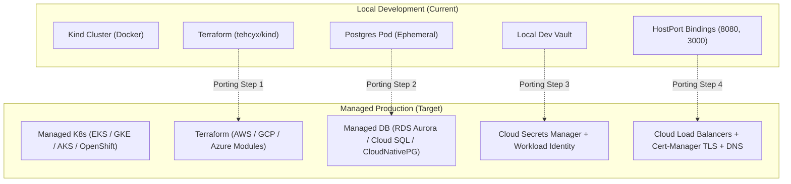

# Production Porting & Cloud Migration Guide

This document outlines the architecture differences, migration roadmap, and detailed activity checklist required to transition the RealEstate-Trust platform from the local **Kind** development cluster to managed cloud Kubernetes platforms (**AWS EKS**, **Google Cloud GKE**, **Azure AKS**, or **Red Hat OpenShift**).

---

## 🗺️ Architecture Overview



---

## 📊 Component-by-Component Delta

| Component Area | Current Local Kind Setup | Target Production (EKS / GKE / AKS / OpenShift) |
| :--- | :--- | :--- |
| **Infrastructure (IaC)** | `tehcyx/kind` provider in [`infra/terraform/`](../infra/terraform/) | Cloud-specific modules (`terraform-aws-modules/eks`, `terraform-google-modules/kubernetes-engine`, `azurerm_kubernetes_cluster`) |
| **Cluster Auth** | Static `kubeconfig_path` from `kind_cluster` resource | Ephemeral IAM auth tokens (AWS IRSA, GCP Workload Identity, Azure Workload Identity) |
| **Container Images** | Loaded directly via `kind load docker-image` | Pushed via CI/CD to a container registry (GHCR, ECR, GCR/GAR, ACR, Quay) with immutable tags |
| **Database** | Standalone dev container in [`infra/kind/manifests/postgres.yaml`](../infra/kind/manifests/postgres.yaml) | Managed DB (AWS Aurora PostgreSQL, GCP Cloud SQL, Azure PostgreSQL) or HA Operator (**CloudNativePG**) |
| **Storage / PVCs** | Kind `standard` hostpath storage class | Cloud CSI StorageClasses (`gp3` on AWS, `standard-rwo` on GKE, `managed-csi` on Azure, Ceph/ODF on OpenShift) |
| **Secrets Management** | Local Vault container with root token in [`deploy-vault-eso.sh`](../infra/kind/deploy-vault-eso.sh) | **External Secrets Operator (ESO)** connected to AWS Secrets Manager, GCP Secret Manager, Azure Key Vault, or Enterprise Vault |
| **IAM & Auth** | Local Keycloak dev realm in [`keycloak-realm.yaml`](../infra/kind/manifests/keycloak-realm.yaml) with `localhost` redirects | Keycloak cluster with HA caching (Infinispan), PostgreSQL backend, and production HTTPS domain redirects |
| **Ingress & Networking** | Istio Gateway with static HostPorts on `localhost` | Cloud Load Balancers (AWS NLB/ALB, GCP Cloud LB, Azure LB) with automated TLS certificates (**Cert-Manager** / Let's Encrypt) |
| **GitOps Manifests** | Single-environment manifests in [`infra/gitops/`](../infra/gitops/) | Multi-environment overlays (`infra/environments/staging/`, `infra/environments/prod/`) with Kustomize / Helm values |
| **DNS & In-Node Caching** | Central CoreDNS deployment in `kube-system` | **NodeLocal DNSCache** DaemonSet (`169.254.20.10`) to eliminate 5s `conntrack` race conditions, cache queries in memory, and query upstream CoreDNS over TCP |
| **Observability** | Single-replica Prometheus, Loki, Tempo with local storage | Prometheus Agent / Grafana Mimir, Loki with S3/GCS object storage, Tempo tracing backend |

---

## 📋 Migration Activities & Checklist

### Phase 1: Infrastructure as Code (Terraform)
- [ ] Create cloud-specific Terraform workspaces or directories (`infra/terraform/environments/{staging,prod}`).
- [ ] Provision VPC, private subnets, NAT Gateways, and security groups.
- [ ] Provision managed Kubernetes cluster (EKS, GKE, AKS, or OpenShift).
- [ ] Provision Managed PostgreSQL instance (e.g. AWS Aurora PostgreSQL) with automated backups and encryption at rest.
- [ ] Configure cloud OIDC Workload Identity provider in IAM.
- [ ] Remove `null_resource.build_and_load_images` and Kind-specific port mappings.

### Phase 2: CI/CD & Artifact Registry
- [ ] Configure automated GitHub Actions / GitLab CI pipelines to build, lint, test, and scan Docker images.
- [ ] Push signed images to container registry (GHCR / AWS ECR / GCP Artifact Registry) tagged with semver and Git commit SHAs.
- [ ] Configure image pull secrets or Cloud IAM Workload Identity on Kubernetes namespaces.

### Phase 3: Ingress, DNS, & Security Hardening
- [ ] Install and configure **Cert-Manager** with ACME Let's Encrypt ClusterIssuers for automated TLS.
- [ ] Deploy Cloud Ingress Controller / Istio Gateway configured with `type: LoadBalancer`.
- [ ] Configure ExternalDNS or Route53 / Cloud DNS / Azure DNS records for microservices and Keycloak.
- [ ] Deploy **NodeLocal DNSCache** DaemonSet (or enable managed cloud DNS cache add-on) to eliminate 5-second `conntrack` UDP race conditions, mitigate `ndots:5` latency, and provide in-node sub-millisecond DNS lookups.
- [ ] Configure NetworkPolicies and Istio Mutual TLS (mTLS) in `STRICT` mode.

### Phase 4: Secrets Management (External Secrets Operator)
- [ ] Provision secrets in cloud Secret Manager (database credentials, JWT signing keys, OAuth client secrets).
- [ ] Configure ESO `ClusterSecretStore` using cloud IAM Workload Identity (no static API keys in cluster).
- [ ] Ensure all Kubernetes `Secret` objects are rendered dynamically from ESO.

### Phase 5: Keycloak IAM Production Setup
- [ ] Deploy Keycloak using PostgreSQL database backend in high-availability mode (2+ replicas).
- [ ] Update `keycloak-realm.yaml`:
  - Replace `http://localhost:*` redirect URIs and web origins with production HTTPS domains (e.g., `https://app.realestate.com/*`).
  - Enable brute-force protection and password complexity policies.
  - Set up SMTP provider for transactional verification emails.

### Phase 6: GitOps (ArgoCD) Environment Structure
- [ ] Structure GitOps repository for environments:
  ```text
  infra/
  ├── environments/
  │   ├── dev-kind/
  │   ├── staging-cloud/
  │   └── prod-cloud/
  ├── gitops/
  │   ├── core-infra-apps.yaml
  │   ├── service-apps.yaml
  │   └── observability-apps.yaml
  └── helm/
      └── charts/
          └── microservice/
  ```
- [ ] Define environment-specific `values-staging.yaml` and `values-prod.yaml` with:
  - Higher replica counts and **Horizontal Pod Autoscalers (HPA)**.
  - Production CPU and memory requests/limits.
  - Production database connection strings and secret references.

---

## 🛡️ Platform-Specific Notes

### AWS EKS
- **IAM**: Use IAM Roles for Service Accounts (IRSA) with EKS Pod Identity.
- **Storage**: Deploy AWS EBS CSI driver and configure `gp3` storage class.
- **Ingress**: Deploy AWS Load Balancer Controller for automatic ALB/NLB provisioning.
- **DNS**: Enable the EKS CoreDNS / NodeLocal DNS add-on or apply the `k8s-dns-node-cache` DaemonSet.

### GCP GKE
- **IAM**: Enable GKE Workload Identity Federation.
- **Storage**: Use Compute Engine persistent disk CSI driver (`standard-rwo` / `premium-rwo`).
- **Ingress**: GKE Ingress with Google-managed SSL certificates or Istio with Cloud Armor.
- **DNS**: Enable in-node DNS cache directly via Terraform: `dns_cache_config { enabled = true }`.

### Azure AKS
- **IAM**: Enable Microsoft Entra Workload ID.
- **Storage**: Use Azure Disk CSI driver (`managed-csi` / `managed-csi-premium`).
- **Ingress**: Azure Application Gateway Ingress Controller (AGIC) or Azure Load Balancer.
- **DNS**: Deploy NodeLocal DNSCache DaemonSet with AKS custom Corefile upstream routing.

### Red Hat OpenShift
- **Security**: Comply with OpenShift `restricted-v2` Security Context Constraints (SCC) (do not run as root / UID 0).
- **Ingress**: Use OpenShift `Route` resources with edge/re-encrypt TLS termination.
- **Storage**: Configure OpenShift Data Foundation (ODF) / Ceph CSI.
- **DNS**: Configure OpenShift In-Cluster DNS Operator with node caching.
