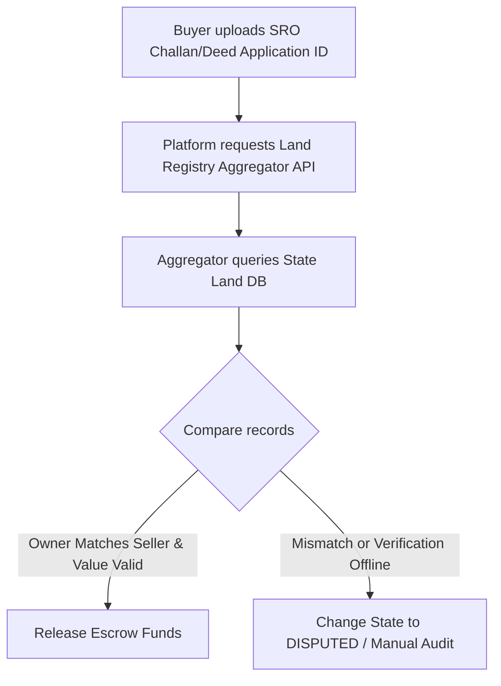

# Banking, KYC & Land Registry API Integrations Research

This document outlines the research and integration specifications for external services required by the Real Estate Trust & Escrow Platform, covering Banking APIs, KYC/AML providers, and India's Sub-Registrar Office (SRO) land records interfaces.

---

## 1. Banking Integrations (Virtual Accounts & Payouts)

To manage escrow trust funds, the platform connects to corporate banking APIs (e.g., Yes Bank API Banking, ICICI Bank Developer Portal, HDFC Bank Developer).

### 1.1 Developer Portals & sandboxes
* **Yes Bank**: Access via [yesdeveloper.in](https://yesdeveloper.in/). Standard products include Co-Branded Cards, Virtual Accounts, and API Banking.
* **ICICI Bank**: Access via [developer.icicibank.com/](https://developer.icicibank.com/). Standard APIs cover corporate payments, virtual account management, and real-time ledger statement callbacks.

### 1.2 Webhook Signature Verification in Go
Banking callbacks must be strictly validated. The following Go code pattern illustrates HMAC-SHA256 signature verification using constant-time string comparison (`crypto/subtle`) to prevent timing attacks:

```go
package security

import (
	"crypto/hmac"
	"crypto/sha256"
	"crypto/subtle"
	"encoding/hex"
)

// ValidateHMACSignature checks if the signature received in the header matches the calculated hash.
func ValidateHMACSignature(rawBody []byte, signatureHeader string, secretKey string) bool {
	h := hmac.New(sha256.New, []byte(secretKey))
	h.Write(rawBody)
	expectedSignature := hex.EncodeToString(h.Sum(nil))

	// Constant-time comparison to prevent timing attacks
	return subtle.ConstantTimeCompare([]byte(signatureHeader), []byte(expectedSignature)) == 1
}
```

*Note: For ICICI Bank, the webhook signing is often based on digital signatures using asymmetric keys (RSA-4096). In that scenario, verify the signature using the bank's public key certificate.*

### 1.3 Security: IP Whitelisting
Banks recommend or enforce whitelisting IP addresses. In Kubernetes, this is configured at the Ingress controller level (see Ingress configuration in the Infrastructure document).

---

## 2. Digital KYC & Identity Verification (Signzy vs. Karza)

Real estate transactions fall under strict Anti-Money Laundering (AML) and KYC regulations. We integrate aggregators like Signzy or Karza (Perfios) to authenticate identities.

### 2.1 Signzy (by Signzy Technologies)
* **Onboarding Journeys**: Ideal for user-facing video verification (Video KYC - V-CIP) and quick no-code configurations.
* **Consent Verification**: Built-in support for capturing user eSignatures and managing Aadhaar consent trails.
* **Features**:
  * Aadhaar OTP and offline XML verification.
  * PAN authentication (checking name match, active status, and matching face verification models).
  * Central KYC (CKYC) registry check.

### 2.2 Karza Risk Intelligence (by Perfios)
* **Data-Heavy Underwriting**: Highly recommended if the platform scales deep financing integrations. Karza aggregates financial data profiles directly from tax registries and credit bureaus.
* **Features**:
  * Corporate verification (MCA filings, GSTIN status, directors verification, DIN details).
  * Bank account validation (Pennydrop API check to confirm account ownership).
  * Court case search and legal verification of entities.

### 2.3 Consent & DPDP Act Compliance
Under the Digital Personal Data Protection (DPDP) Act of India, the platform must:
1. Capture explicit consent from the user before executing any PAN/Aadhaar check.
2. Store the timestamped consent token and transaction ID in the ledger.
3. Obfuscate Aadhaar numbers (mask the first 8 digits) in database storage.

---

## 3. Land Registry & SRO (Sub-Registrar Office) Integrations

Verifying the legal deed registration confirms that the asset has changed ownership before releasing escrow funds.

### 3.1 State-Specific Portals (Decentralized System)
Land records in India are handled by state-specific governments:
* **Maharashtra**: Mahabhulekh & IGR Maharashtra.
* **Karnataka**: Bhoomi Portal.
* **Telangana**: Dharani Portal.
* **Uttar Pradesh**: Bhulekh UP.

### 3.2 Aggregation Middleware Providers
Because there is no single national API for all states, third-party middleware APIs (e.g., Karza Land Records API, Surepass Land API) are used. 

#### Request Parameters:
To query land records, the platform must send a normalized payload mapping:
* `state_code` (e.g., MH, KA)
* `district_name` / `sub_district`
* `village_code`
* `survey_number` or `khata_number` / `plot_number`

#### Validation Logic Flow:


### 3.3 Offline Fallback
State APIs can experience high latency or downtime. The platform must maintain a **Verifier Portal** role where an internal legal officer can upload official registration papers, review them, and manually sign off to trigger transition states.
