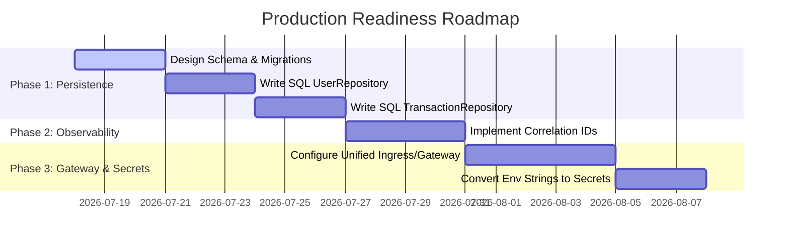

# Production-Readiness & Architectural Review

> [!NOTE]
> **Status: RESOLVED**
> All architectural gaps identified in this report have been fully implemented and verified in the codebase.
> - **Persistence Gap**: Connected Go microservices to PostgreSQL, configured migrations, and verified DB persistence.
> - **Queue Resiliency**: Configured RabbitMQ Dead Letter Queues (DLQ), enabled Publisher Confirms, and implemented consumer idempotency.
> - **Edge Routing**: Integrated Istio Ingress Gateway as a unified API entry point and configured permissive mTLS.
> - **Log Correlation**: Implemented structured log correlation using UUID Correlation IDs passed via `X-Correlation-ID` headers and RabbitMQ message headers.
> For details on the implementation, see the [walkthrough.md](file:///Users/nitishshanchinagoudra/workspace/me/realestate-trust/docs/walkthrough.md).
>
> This report audits the historical architecture and codebase of the **RealEstate Trust** platform against backend architecture best practices, security standards, and high-availability design patterns.

---

## 1. The Persistence Gap (Critical Blocker)

> [!WARNING]
> All microservices currently execute against in-memory mock repositories (e.g., `NewInMemoryUserRepository`, `NewInMemoryTransactionRepository`).

* **The Problem**: Pods in Kubernetes are ephemeral. If an `identity-service` or `transaction-manager` pod restarts due to a deployment, node upgrade, or liveness probe failure, **all user data, active sessions, transaction states, fractional pools, and property listings are permanently lost.**
* **Current Setup**: PostgreSQL databases are deployed in the cluster, but the microservices' `main.go` entrypoints do not instantiate database connections or execute SQL statements against them.
* **Production Requirement**:
  1. Write Postgres-backed implementations of the repository interfaces (`UserRepository`, `TransactionRepository`, etc.) using Go's `database/sql` or `pgx/v5` connection pools.
  2. Implement schema migration pipelines (e.g. using `golang-migrate`) that execute automatically in Helm pre-install hooks (instead of inline seeding).
  3. Instantiate these database repositories when the `DATABASE_URL` environment variable is detected.

---

## 2. Queue Architecture & Reliability Hardening

The integration of RabbitMQ for event-driven logging (`transaction-manager` -> `ledger-service`) is a major architectural improvement, but it lacks production resilience patterns:

```mermaid
graph TD
    subgraph Current Flow
        Tx["transaction-manager"] -->|Publish| Ex["Exchange"]
        Ex -->|Route| Q["transaction-events Queue"]
        Q -->|Consume| L["ledger-service"]
    end
    subgraph Production Hardened Flow
        Tx2["transaction-manager"] -->|Publish with Publisher Confirms| Ex2["Exchange"]
        Ex2 -->|Route| Q2["Quorum Queue"]
        Q2 -->|Consume| L2["ledger-service"]
        L2 -->|Fail| DLX["Dead Letter Exchange (DLX)"]
        DLX -->|Route| DLQ["Dead Letter Queue (DLQ)"]
        DLQ -->|Alerting| Slack["Operator Alerting"]
    end
```



* **Missing Resiliency Patterns**:
  * **No Dead Letter Queues (DLQ)**: If `ledger-service` fails to process a corrupted or schema-incompatible message (a "poison pill"), it will either lose the message permanently (if auto-acked) or enter an infinite loop of failures (if nacked and requeued).
  * **No Publisher Confirms**: The publisher sends messages to RabbitMQ fire-and-forget. If the broker is overloaded or restarts, messages are lost without the publisher knowing.
  * **No Consumer Idempotency**: If a network glitch occurs during message acknowledgment, RabbitMQ will redeliver the message. Without an idempotency check (e.g., matching a `TransactionEvent.ID` against a database of processed event IDs), the ledger will record duplicate audit blocks.
* **Production Requirement**:
  1. Declare a **Dead Letter Exchange (DLX)** and **Dead Letter Queue (DLQ)** in `internal/events/rabbitmq.go`.
  2. Enable **Publisher Confirms** on the publisher channel to block until RabbitMQ confirms receipt.
  3. Implement database constraints on the ledger database to prevent duplicate block creation from redelivered events.

---

## 3. Edge Routing: Lacking an API Gateway

```mermaid
graph TD
    subgraph Current Setup (Direct Access)
        Client["Browser / Mobile Client"] -->|Port 3000| FE["Next.js Frontend"]
        Client -->|Port 8080| TM["Transaction Manager"]
        Client -->|Port 8081| IS["Identity Service"]
        Client -->|Port 8084| LS["Ledger Service"]
    end
    subgraph Production Architecture (API Gateway)
        Client2["Browser / Mobile Client"] -->|Port 443 (Single IP)| GW["API Gateway (e.g., Kong / Envoy)"]
        GW -->|/| FE2["Next.js Frontend"]
        GW -->|/api/v1/transactions| TM2["Transaction Manager"]
        GW -->|/api/v1/users| IS2["Identity Service"]
        GW -->|/api/v1/ledger| LS2["Ledger Service"]
    end
```

* **The Problem**: Currently, the Next.js frontend connects directly to each microservice using six distinct NodePorts (`8080`–`8085`).
* **Architectural Risk**:
  * Exposing six separate services publicly is a major security exposure.
  * In production, this requires provisioning and paying for six separate Load Balancers, or configuring complex ingress routing with multiple subdomains.
  * Implementing global security logic (like DDoS protection, rate limiting, request tracing, and CORS policies) has to be duplicated across six distinct codebases.
* **Production Requirement**:
  - Introduce an **API Gateway** (such as Kong, Traefik, or APISIX) or unified Ingress Controller as the single entry point.
  - Route all public requests through a single domain on port `443` and map subpaths (e.g., `/api/v1/users` -> `identity-service:8081`).
  - Offload SSL termination, global rate limiting, and CORS checks to the gateway.

---

## 4. Observability & Log Correlation

When a user initiates an escrow transaction, the request flows across multiple boundaries:
```
Client -> API Gateway -> transaction-manager -> RabbitMQ -> ledger-service -> Postgres
```
* **The Problem**: If a database write fails in the final step, it is extremely difficult to diagnose because the logs in `transaction-manager` and `ledger-service` are completely disconnected. There is no shared identifier.
* **Production Requirement**:
  1. **Correlation IDs**: Generate a unique Request/Correlation ID at the Ingress/Gateway level or in the Next.js client.
  2. **Propagation**: Pass this ID as an HTTP header (`X-Correlation-ID`) on all REST calls, and inject it as a message header/property in RabbitMQ events.
  3. **Structured Logs**: Include the Correlation ID in every `slog` output, allowing developers to query a centralized logging tool (e.g., Loki, Elastic) and trace a single transaction's lifecycle across the entire system.
  4. **Tracing**: Integrate OpenTelemetry (OTel) to collect trace spans and export them to Jaeger or Datadog.

---

## 5. Secret Management & Hardening

* **The Problem**: In the Kind manifests, configuration properties and credentials like `DATABASE_URL` and `RABBITMQ_URL` are stored as hardcoded plaintext strings directly inside values configuration files.
* **Production Requirement**:
  - Integrate an **External Secrets Operator (ESO)**.
  - Store credentials securely in a dedicated vault (HashiCorp Vault, AWS Secrets Manager, or GCP Secret Manager).
  - Use Kubernetes `Secret` resources created dynamically by the operator and mount them in pods using `valueFrom.secretKeyRef`.

---

## 🚀 Priority Action Plan

To transition this workspace to a production-ready baseline, we should execute the following steps:


