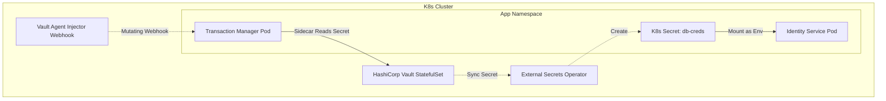

# Secrets Management with HashiCorp Vault in Kubernetes

This document provides the design architecture, installation procedures, and injection patterns for integrating **HashiCorp Vault** as the central secrets manager inside the local Kind cluster.

---

## 1. Architecture Overview

To secure and inject secrets without hardcoding credentials in git, we can run HashiCorp Vault directly in the cluster and use either the **Vault Agent Injector** or the **External Secrets Operator (ESO)** to inject credentials into microservice pods dynamically:



---

## 2. Option A: Vault Agent Injector (Sidecar Pattern)

The **Vault Agent Injector** uses a mutating admission webhook controller. When you label a pod with specific annotations, Vault automatically injects a sidecar container that authenticates with Vault, retrieves the secret, and writes it to a shared memory volume `/vault/secrets/`.

### Step 1: Install Vault via Helm
Add the official HashiCorp chart and install it in development/dev mode (in-memory, unsealed by default for testing):

```bash
helm repo add hashicorp https://helm.releases.hashicorp.com
helm repo update

helm upgrade --install vault hashicorp/vault \
  --namespace vault --create-namespace \
  --set "server.dev.enabled=true" \
  --set "injector.enabled=true"
```

### Step 2: Configure Kubernetes Auth Method inside Vault
Access the Vault pod and configure it to accept Kubernetes service account tokens for authentication:

```bash
# Exec into Vault
kubectl exec -it vault-0 -n vault -- /bin/sh

# Enable Kubernetes Auth
vault auth enable kubernetes

# Configure Vault to look up tokens against K8s API
vault write auth/kubernetes/config \
    kubernetes_host="https://kubernetes.default.svc:443"

# Write dummy database credentials
vault kv put secret/realestate-trust/database \
    username="postgres" \
    password="my-vault-secret-password"

# Create a policy allowing access
vault policy write app-read - <<EOF
path "secret/data/realestate-trust/*" {
  capabilities = ["read"]
}
EOF

# Bind the policy to the app's ServiceAccount
vault write auth/kubernetes/role/identity-service-role \
    bound_service_account_names=identity-service \
    bound_service_account_namespaces=realestate-trust \
    policies=app-read \
    ttl=24h
```

### Step 3: Inject Secrets into the Pod (Deployment Spec)
Annotate the microservice deployment to auto-inject the secret at `/vault/secrets/database`:

```yaml
apiVersion: apps/v1
kind: Deployment
metadata:
  name: identity-service
  namespace: realestate-trust
spec:
  template:
    metadata:
      annotations:
        # Enable sidecar injection
        vault.hashicorp.com/agent-inject: "true"
        # Specify the Vault role to authenticate with
        vault.hashicorp.com/role: "identity-service-role"
        # Secret path in Vault
        vault.hashicorp.com/agent-inject-secret-database: "secret/data/realestate-trust/database"
        # Template to format the output as environment variables
        vault.hashicorp.com/agent-inject-template-database: |
          {{- with secret "secret/data/realestate-trust/database" -}}
          export POSTGRES_USER="{{ .Data.data.username }}"
          export POSTGRES_PASSWORD="{{ .Data.data.password }}"
          {{- end -}}
    spec:
      serviceAccountName: identity-service
      containers:
        - name: app
          image: ghcr.io/realestate-trust/monorepo/identity-service:latest
          # Source the injected env file before starting the binary
          command: ["/bin/sh", "-c", "source /vault/secrets/database && /app"]
```

---

## 3. Option B: External Secrets Operator (ESO)

The **External Secrets Operator (ESO)** is a control-plane operator that reads secrets from Vault and syncs them into standard, native Kubernetes `Secret` resources.

### Step 1: Install ESO
```bash
helm repo add external-secrets https://charts.external-secrets.io
helm repo update

helm upgrade --install external-secrets external-secrets/external-secrets \
  --namespace external-secrets --create-namespace
```

### Step 2: Define the ClusterSecretStore
Create a resource that tells ESO where to find your Vault instance:

```yaml
apiVersion: external-secrets.io/v1beta1
kind: SecretStore
metadata:
  name: vault-backend
  namespace: realestate-trust
spec:
  provider:
    vault:
      server: "http://vault.vault.svc.cluster.local:8200"
      path: "secret"
      version: "v2"
      auth:
        kubernetes:
          mountPath: "kubernetes"
          role: "identity-service-role"
```

### Step 3: Define the ExternalSecret Mapping
Instruct ESO to dynamically create and update a standard K8s Secret from the Vault KV engine:

```yaml
apiVersion: external-secrets.io/v1beta1
kind: ExternalSecret
metadata:
  name: db-credentials-sync
  namespace: realestate-trust
spec:
  refreshInterval: "1h" # Sync interval
  secretStoreRef:
    name: vault-backend
    kind: SecretStore
  target:
    name: postgres-credentials # Native Secret created by ESO
    creationPolicy: "Owner"
  data:
    - secretKey: POSTGRES_USER
      remoteRef:
        key: realestate-trust/database
        property: username
    - secretKey: POSTGRES_PASSWORD
      remoteRef:
        key: realestate-trust/database
        property: password
```

---

## 4. Evaluation: Agent Injector vs. ESO

| Feature | Vault Agent Injector | External Secrets Operator (ESO) |
| :--- | :--- | :--- |
| **Secret Storage Location** | Exclusively in memory (`tmpfs` volume in pod). Never written to disk. | Stored as standard base64 Kubernetes `Secret` resources in etcd. |
| **Code Changes Required** | Requires updating pod startup commands (`source /vault/secrets/...`). | No changes. Pods access standard Kubernetes environment variables. |
| **RBAC / Least Privilege** | Extremely strong (each Pod authenticates directly with Vault). | Slightly weaker (Operator requires cluster-wide Vault credentials to create K8s Secrets). |
| **Audit Trails** | High granularity (Vault log maps queries back to individual Pod identities). | Lower granularity (Vault logs show all reads originating from the Operator's account). |

### Recommended Choice
For local Kind environments and standard container apps, **External Secrets Operator (ESO)** is recommended because it integrates natively with standard Kubernetes deployment manifests (no custom startup wrapper commands needed). For highly regulated environments handling cryptographic ledger access keys, the **Vault Agent Injector** is preferred to prevent secrets from being written to Kubernetes `etcd` logs.
