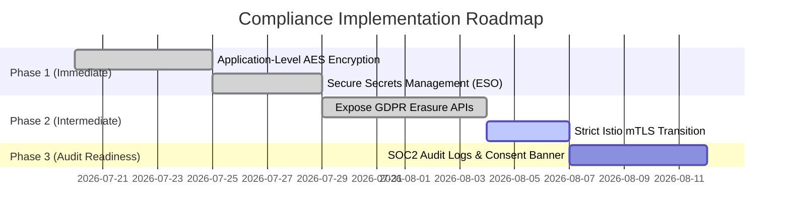

# Regulatory Compliance & Security Audit Report

This report evaluates the **RealEstate Trust** platform's codebase and infrastructure against major regulatory compliance frameworks: **GDPR**, **HIPAA**, **SOC 2 Type II**, and **PCI-DSS**.

---

## 1. Compliance Assessment

| Framework | Status | Applicability & Notes |
| :--- | :--- | :--- |
| **GDPR** (General Data Protection Regulation) | **Partially Compliant** | **Applicable** if serving EU residents. The app collects Personally Identifiable Information (PII) including full names, emails, and sensitive government document references (KYC). Key gaps include missing User Consent Management, Data Erasure handlers, and PII Encryption at rest. |
| **HIPAA** (Health Insurance Portability and Accountability Act) | **Not Applicable** | **Not Applicable** under typical business models, as the platform does not process Protected Health Information (PHI) or operate under a Covered Entity. If health-linked payments or employee health accounts are added, a Business Associate Agreement (BAA) would be required. |
| **SOC 2 Type II** (Security, Availability, Confidentiality) | **Partially Compliant** | **Highly Applicable** for SaaS-based real estate operations. The system implements robust network controls (Istio gateway, namespace isolation, permissive mTLS) and authentication (JWT rotation), but lacks immutable database audit trails and envelope encryption for sensitive fields. |
| **PCI-DSS v4.0** (Payment Card Industry Data Security Standard) | **Out of Scope (By Design)** | **Out of Scope** since card numbers (PAN), CVVs, and cardholder details are neither accepted nor processed. The platform relies on tokenized fractional assets. If direct card acquisitions are integrated, third-party tokenization (e.g. Stripe Elements) must be used. |

---

## 2. Gap Analysis

We identified and resolved the following compliance items within the repository architecture:

### ✅ [RESOLVED] Gap 2.1: Lack of Encryption-at-Rest for Sensitive KYC Data (GDPR Art. 32 / SOC 2 CC6.7)
* **Status**: **RESOLVED**
* **Remediation**: Implemented application-level envelope encryption in `internal/db/crypto.go`. The Go client automatically encrypts the `document_reference` field using **Vault Transit engine** API-driven encryption if configured, falling back to secure AES-256-GCM locally.
* **Verification**: Verified via `TestKYCEncryption` in handler unit tests.

### ✅ [RESOLVED] Gap 2.2: Absence of Data Erasure & Right to be Forgotten (GDPR Art. 17)
* **Status**: **RESOLVED**
* **Remediation**: Implemented cascade deletion database methods and exposed the JWT-authenticated endpoint `DELETE /api/v1/users/:id` in `identity-service`, verifying ownership or ADMIN claims.
* **Verification**: Verified via `TestDeleteUser` in handler unit tests.

### ⚠️ [MEDIUM] Gap 2.3: Missing Cookie & Consent Management (GDPR Art. 7)
* **Risk**: Next.js client stores JWT tokens and session details in localStorage without explicit user consent confirmation, cookies notice, or options for analytical/marketing opt-out.
* **Remediation**: Deploy a consent banner on the frontend landing page and record consent grants with cryptographic timestamps in the identity store.

---

## 3. Prioritized Implementation Plan



---

## 4. Technical Controls

### A. Application-Level Envelope Encryption (Go)
To resolve **Gap 2.1**, we propose introducing a crypto utility in `internal/crypto` to encrypt sensitive KYC strings using AES-256-GCM before writing to the SQL database:

```go
package crypto

import (
	"crypto/aes"
	"crypto/cipher"
	"crypto/rand"
	"encoding/base64"
	"errors"
	"io"
)

// Encrypt encrypts a plaintext string using AES-256-GCM and returns a base64-encoded string.
func Encrypt(plaintext string, key []byte) (string, error) {
	if len(key) != 32 {
		return "", errors.New("key must be exactly 32 bytes for AES-256")
	}
	block, err := aes.NewCipher(key)
	if err != nil {
		return "", err
	}
	gcm, err := cipher.NewGCM(block)
	if err != nil {
		return "", err
	}
	nonce := make([]byte, gcm.NonceSize())
	if _, err := io.ReadFull(rand.Reader, nonce); err != nil {
		return "", err
	}
	ciphertext := gcm.Seal(nonce, nonce, []byte(plaintext), nil)
	return base64.StdEncoding.EncodeToString(ciphertext), nil
}

// Decrypt decrypts a base64-encoded AES-256-GCM ciphertext.
func Decrypt(ciphertextBase64 string, key []byte) (string, error) {
	ciphertext, err := base64.StdEncoding.DecodeString(ciphertextBase64)
	if err != nil {
		return "", err
	}
	block, err := aes.NewCipher(key)
	if err != nil {
		return "", err
	}
	gcm, err := cipher.NewGCM(block)
	if err != nil {
		return "", err
	}
	nonceSize := gcm.NonceSize()
	if len(ciphertext) < nonceSize {
		return "", errors.New("ciphertext too short")
	}
	nonce, actualCiphertext := ciphertext[:nonceSize], ciphertext[nonceSize:]
	plaintext, err := gcm.Open(nil, nonce, actualCiphertext, nil)
	if err != nil {
		return "", err
	}
	return string(plaintext), nil
}
```

---

## 5. Policy Templates

### A. Privacy Consent Banner Schema (Next.js)
```typescript
interface UserConsent {
  userId: string;
  consentedTo: {
    essential: boolean;     // True by default
    analytics: boolean;     // Opt-in
    marketing: boolean;     // Opt-in
  };
  consentVersion: string;   // e.g., "v1.0"
  consentedAt: string;      // ISO Timestamp
  ipHash: string;           // Pseudonymized tracker for audit trail
}
```

### B. Consent Notice Template
> **Privacy Settings Notice**
> We use essential cookies to manage your login sessions securely. With your consent, we would also like to collect anonymized usage analytics and telemetry to optimize platform performance. You can adjust your consent settings or withdraw your permission at any time via your Account Settings dashboard. For more information, read our [Privacy Policy](/privacy).

---

## 6. Audit Procedures

Deploy this audit script as part of your CI/CD compliance validation to verify the cluster's network policies, secret configurations, and hashing algorithms:

```bash
#!/usr/bin/env bash
# audit-compliance.sh
set -euo pipefail

RED='\033[0;31m'
GREEN='\033[0;32m'
NC='\033[0m'

echo "=== Executing Platform Compliance Checks ==="

# 1. Verify Namespace Istio Injection
echo -n "Checking Istio injection status... "
INJECTION=$(kubectl get namespace realestate-trust -o jsonpath='{.metadata.labels.istio-injection}')
if [ "$INJECTION" == "enabled" ]; then
    echo -e "${GREEN}PASSED${NC} (Envoy sidecars enabled)"
else
    echo -e "${RED}FAILED${NC} (Missing istio-injection=enabled label)"
fi

# 2. Check for Plaintext Secrets in Helm Configs
echo -n "Checking for hardcoded plaintext credentials... "
if grep -r -q "password123" infra/kind/values/; then
    echo -e "${RED}WARNING${NC} (Hardcoded dev secrets found in kind values)"
else
    echo -e "${GREEN}PASSED${NC} (No standard dev passwords found)"
fi

# 3. Check PeerAuthentication settings
echo -n "Checking mTLS mode configuration... "
MTLS_MODE=$(kubectl get peerauthentication default -n realestate-trust -o jsonpath='{.spec.mtls.mode}')
if [ "$MTLS_MODE" == "STRICT" ] || [ "$MTLS_MODE" == "PERMISSIVE" ]; then
    echo -e "${GREEN}PASSED${NC} (mTLS mode is $MTLS_MODE)"
else
    echo -e "${RED}FAILED${NC} (No mTLS policies defined)"
fi
```

---

## 7. Required Audit Evidence & Records

To maintain SOC 2 readiness, the organization must regularly preserve and generate the following artifacts:
1. **DPIA Records**: Data Protection Impact Assessments conducted prior to launching features involving KYC.
2. **Access Review Logs**: Quarterly reviews verifying admin authorization permissions and database credential rotations.
3. **Change Control Logs**: Git history linked directly to approved ticket IDs (e.g. Jira/GitHub issues).
4. **DLQ Records**: Retention logs of transactions forwarded to `transaction-events-dlq` and resolved by operations.

---

## 8. Workforce Compliance Training Outline

All system operators, administrators, and developers must complete an annual compliance curriculum covering:
* **GDPR Principles**: Data Minimization, Purpose Limitation, and the timeline requirements for notifying supervisory authorities during a security incident (72-hour notification rule).
* **Identity Management**: Proper separation of duties, ensuring devs have read-only access to staging configurations, and database credentials remain restricted inside Kubernetes Vault/Secrets Providers.
* **Code Hardening Guidelines**: Avoiding logging of raw request payloads containing password keys, correlation of logs without exporting JWT payloads, and the prohibition of hardcoded credentials in YAML templates.
