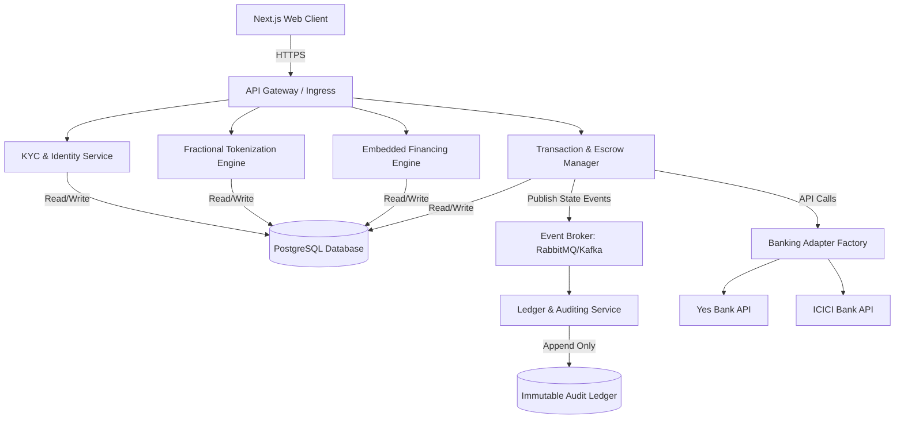
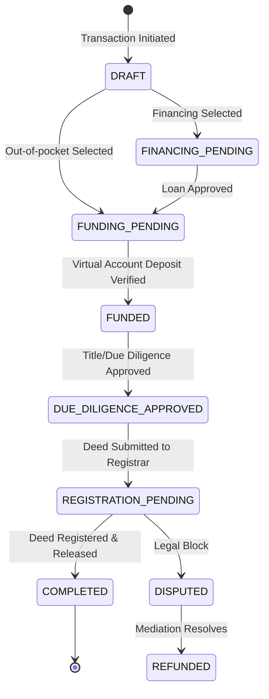

# Real Estate Trust & Escrow Platform
## Definitive System Manual

**Version 1.0**

---

## 1. Executive Summary

The **Real Estate Trust & Escrow Platform** is an enterprise-grade, event-driven microservices ecosystem designed to handle high-value real estate transactions, fractional asset investments, embedded financing, and cryptographic auditing.

Unlike traditional e-commerce platforms, real estate transactions require multi-party sign-offs, legal verifications, integration with external bank virtual accounts, and absolute data immutability. This system addresses these requirements through a robust state machine, strict RBAC authorization, and an append-only cryptographic ledger.

---

## 2. Architecture Overview

The system employs an event-driven microservices architecture built primarily with **Go (Golang)** on the backend and **Next.js (React)** on the frontend. The backend services utilize the high-performance **Echo** web framework.



### 2.1 Design Decisions
- **Monorepo Structure**: All code (frontend, microservices, infra) resides in a single repository for version synchronization and shared protobuf definitions.
- **Go with Echo v5**: Chosen for its high performance, extensibility, and clean data-binding APIs.
- **Next.js App Router**: Provides server-side rendering, optimized bundle sizes (via `standalone` builds), and rapid UI iteration.
- **Distroless Containerization**: Microservices are packaged in Google's `distroless/static-debian11:nonroot` images. This reduces image size to ~18MB, minimizes the attack surface (no shell), and forces secure, non-root execution.
- **Immutable Ledger**: To guarantee trust, every transactional state change is hashed with SHA-256 and cryptographically chained to the previous block, creating an immutable history similar to a blockchain.

---

## 3. Core Components Deep Dive

### 3.1 Transaction & Escrow Manager (`transaction-manager`)
The core payment engine and state machine coordinator.
- **Responsibilities**: Spawning transaction-bound Virtual Accounts via bank APIs, managing the escrow lifecycle (`DRAFT` → `FUNDED` → `COMPLETED`), checking reconciled deposit webhooks, and executing payouts to sellers upon deed registration.
- **Design Pattern**: Utilizes the **Banking Adapter Factory** (`IBankingAdapter` interface in Go) to seamlessly integrate with multiple banking providers without altering core escrow logic.

### 3.2 KYC & Identity Service (`identity-service`)
The gatekeeper for authentication, Role-Based Access Control (RBAC), and digital identity compliance.
- **Responsibilities**: Managing profiles (`BUYER`, `SELLER`, `INVESTOR`), verifying KYC documentation, and tracking user consent logs for DPDP Act compliance. Only approved users can unlock financial pathways.

### 3.3 Embedded Financing Engine (`financing-engine`)
The mortgage loan orchestrator.
- **Responsibilities**: Integrating with NBFCs/Lenders, tracking loan application statuses, and routing disbursed funds directly into the corresponding transaction's virtual escrow account.

### 3.4 Fractional Tokenization Engine (`tokenization-engine`)
The asset equity fractionalization tracker.
- **Responsibilities**: Managing property token pools, dividing asset equity into affordable shares (e.g., ₹10,000/share), updating capitalization tables, and locking pool funds in escrow until the property is fully funded.

### 3.5 Ledger & Auditing Service (`ledger-service`)
The system's trust layer.
- **Responsibilities**: Subscribing to transaction state events (via Kafka/RabbitMQ) and appending cryptographic blocks to the database. It actively runs verification checks to detect database tampering.

---

## 4. Escrow State Machine

A real estate escrow account follows a strict state progression. Funds are locked, verified, and released only after due diligence.



---

## 5. Security & Trust Architecture

### 5.1 Immutable Hashing
The `ledger-service` maintains sequential integrity. The hash for any ledger entry is calculated as:
`current_hash = SHA256(transaction_id + state_from + state_to + actor_id + previous_hash)`
Any direct database modification invalidates the downstream hash chain, instantly flagging the data as corrupted.

### 5.2 Banking Webhook Signatures
Incoming deposit notifications from bank APIs (e.g., `/api/v1/webhooks/bank/{provider_slug}/deposit`) are authenticated using an HMAC SHA-256 signature calculated against a securely stored webhook secret.

### 5.3 Kubernetes IAM Isolation
By running each microservice in its own isolated Deployment Pod, we apply **IAM Roles for Service Accounts (IRSA)**. The `identity-service` accesses KYC vault secrets, while the `transaction-manager` accesses banking API secrets, strictly enforcing the principle of least privilege.

---

## 6. Deployment Architecture

### 6.1 Multi-Stage Distroless Builds
The platform achieves massive container size reductions and security hardening by utilizing multi-stage Dockerfiles. The build stage compiles statically linked Go binaries (`CGO_ENABLED=0`), which are then transferred to a scratch/distroless execution layer.

```dockerfile
# Example Go Microservice Build
FROM golang:1.26.5-alpine AS builder
# ... (compile binary)

# Production Target
FROM gcr.io/distroless/static-debian11:nonroot
COPY --from=builder /bin/service /
USER nonroot:nonroot
ENTRYPOINT ["/service"]
```

### 6.2 Next.js Standalone Optimization
The Next.js frontend utilizes `output: "standalone"` in `next.config.ts`. This traces required dependencies at build time, shrinking the production image by excluding development modules and massive `node_modules` caches.

### 6.3 Local Kubernetes (Kind)
The local development environment mirrors production networking using a Kind (Kubernetes IN Docker) cluster provisioned via `./infra/kind/kind-up.sh`.

---

## 7. End-to-End User Journeys

### Journey 1: The Buyer Escrow Flow
1. **KYC Registration**: Register as a `BUYER` and submit ID documents. Wait for `APPROVED` status.
2. **Escrow Initialization**: Create a transaction for a property listing, locking in the price and participants.
3. **Fund Virtual Account**: The platform spawns a bank virtual account. The buyer deposits earnest money, transitioning the deal to `FUNDED`.
4. **Closing**: Once the title is registered, the escrow releases funds to the seller, and a cryptographically sealed block is appended to the ledger.

### Journey 2: Fractional Investor Flow
1. **KYC Verification**: Only compliant users can view investment assets.
2. **Browse Pools**: Navigate to Fractional Pools to review properties broken into micro-shares (e.g., 1000 shares of a ₹10,000,000 property).
3. **Invest**: Purchase X amount of shares. The `tokenization-engine` instantly locks funds and increments the capitalization table, generating an immutable audit log of your ownership.

### Journey 3: Cryptographic Auditor Flow
1. **Inspect Logs**: System Auditors can view the Ledger Logs UI to examine sequential block hashes.
2. **Verify Chain**: By comparing the `Hash` of Block N-1 with the `Prev Hash` of Block N, auditors can independently verify the unbroken cryptochain of the real estate transaction's history.

---

## 8. Production Readiness & Future Enhancements

Before deploying this platform to a public cloud production environment (e.g. AWS EKS, GCP GKE), the following engineering enhancements must be implemented:

### 8.1 Industry-Standard Managed Chart Migrations
- **Database & Queue Infrastructure**: Replace the local custom minimalist Kubernetes manifests (`manifests/postgres.yaml` and `manifests/rabbitmq.yaml`) with official **Bitnami Helm Charts** (or Cloud-native managed services like AWS RDS for Postgres and Amazon MQ for RabbitMQ).
- **High Availability & Clustering**: Deploy RabbitMQ in a clustered multi-node configuration with quorum queues, and deploy PostgreSQL with PgBouncer connection pooling and active replication (Primary/Standby).

### 8.2 Secret Management & Hardening
- **Decouple Secrets**: Migrate raw connection string environment variables (like `RABBITMQ_URL` and `DATABASE_URL`) out of Helm values and configuration maps.
- **Vault/KMS Integrations**: Store database credentials and queue authentication tokens inside a secure secrets manager (like HashiCorp Vault, AWS Secrets Manager, or Google Secret Manager) and inject them dynamically via **Kubernetes external-secrets** or AWS IAM Roles for Service Accounts (IRSA).

### 8.3 SSL/TLS Ingress & Network Policies
- Enforce strict HTTPS/WSS communication globally by implementing a production-grade ingress controller (like NGINX Ingress or Traefik) bound to cert-manager for automatic Let's Encrypt SSL certificate provisioning.
- Set up strict Kubernetes NetworkPolicies to lock down inter-service communication (e.g., only allowing `transaction-manager` and `ledger-service` to connect to RabbitMQ, while blocking direct access from the frontend).
