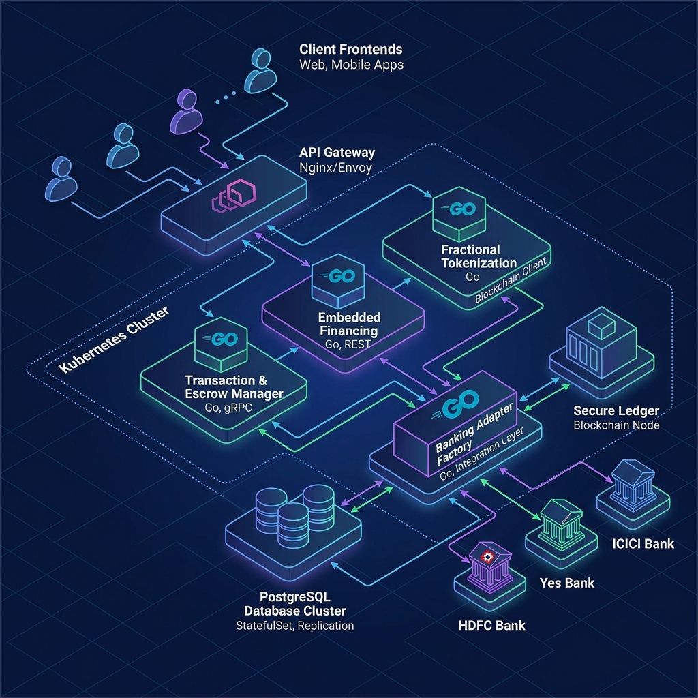

# Walkthrough - Real Estate Trust & Escrow Architecture Design

We have created and updated the comprehensive system design document for the real estate marketplace's escrow, payment, and tokenization features, and completed deep-research documentation on integrations, infrastructure, and observability.

## System Architecture Diagram

## Changes Made
- Created and updated [architecture_design.md](./architecture_design.md) containing the full architectural blueprint of the platform.
- Created [best_practices.md](./best_practices.md) documenting engineering guidelines for observability, security, and cost-effectiveness.
- Created [microservices.md](./microservices.md) detailing the functional scopes and databases of the Go-based services.
- Created and updated [project_structure.md](./project_structure.md) specifying the Monorepo design, multi-stage Docker build files, Kubernetes mapping tables, Infrastructure as Code (IaC) layouts, and UI Frontend specifications.

### Deep Research & Context Documents
We have established a dedicated research directory `docs/research/` containing detailed context analyses:
1. **Banking & KYC Integrations**: [docs/research/banking_kyc_integrations.md](./research/banking_kyc_integrations.md) mapping sandbox setups, verification endpoints, and Go signature verification algorithms.
2. **Kubernetes Infrastructure**: [docs/research/infra_kubernetes.md](./research/infra_kubernetes.md) mapping Cilium CNI, Karpenter auto-scalers, Ingress IP whitelists, and database connection pooling.
3. **Observability & Tracing**: [docs/research/observability_tracing.md](./research/observability_tracing.md) mapping OpenTelemetry in Go, Prometheus metrics mapping tables, and pg_locks database telemetry.
4. **Loki Logging & Audit**: [docs/research/loki_logging_spec.md](./research/loki_logging_spec.md) detailing standardized JSON schemas, Promtail parser configurations, and concrete LogQL queries.

### What Was Designed
1. **System & Microservices Architecture**: An event-driven architecture mapping the client gateway, microservices, PostgreSQL database, transaction ledgers, event brokers, and a multi-bank adapter factory layer.
2. **Go (Golang) Codebase Selection**:
   - Specified Go as the primary programming language for all microservices.
   - Refactored the core **Banking Service Adapter Interface** (`IBankingAdapter`) to Go struct/interface syntax.
3. **Containerization & Kubernetes Specifications**:
   - Added a multi-stage Docker build pipeline (`Dockerfile`) for minimal, secure Go containers.
   - Designed Kubernetes YAML manifests for the microservices including a `Deployment` setup, `Service` configuration, and `HorizontalPodAutoscaler` (HPA) resource profiles.
4. **Multi-Banking Partner Support**:
   - Configured dynamic, slug-based webhook endpoints: `/api/v1/webhooks/bank/{provider_slug}/deposit`.
   - Setup provider routing rules.
5. **Escrow State Machine**: A strict transactional state machine representing the lifecycle of real estate escrow from draft and financing through deposit validation, due diligence checks, registration status verification, and completed release or refund state.
6. **Database Schema Design**: Fully formatted PostgreSQL schema detailing relational tables including `bank_partners` config table.
7. **API Specifications**: Rest API specs detailing endpoint routes, parameters, structures, and payload JSON for key workflows, updated to accept optional preferred banking partner IDs.
8. **Trust and Security Layer**: Specifications for cryptographic transaction state chaining, multi-signature approvals, and provider-specific HMAC validation for webhooks.

## Verification
- Reviewed the generated markdown files to ensure syntax correctness of all SQL queries, JSON payloads, Go codes, and Mermaid diagrams.
